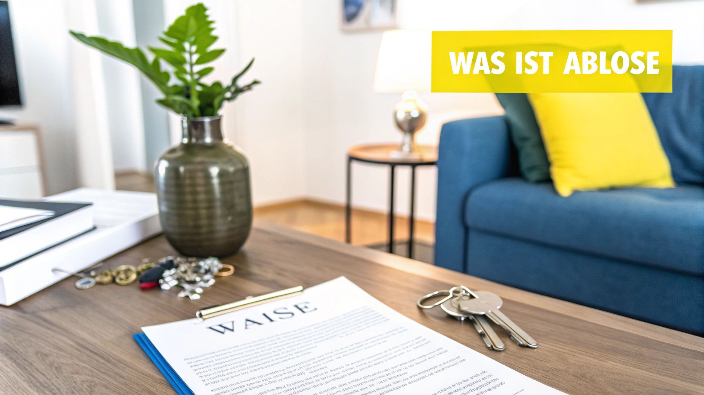

Du ziehst um und deine geliebte, maßgeschneiderte Küche passt einfach nicht in die neue Wohnung? Das kenne ich nur zu gut. Genau für solche Fälle gibt es die **Ablösevereinbarung**. Das ist im Grunde ein unkomplizierter, privater Vertrag zwischen dir und deinem Nachmieter. Ihr regelt damit, dass er dir deine Küche oder andere Einbauten abkauft und du den ganzen Kram nicht ausbauen musst.

## Was eine Ablösevereinbarung wirklich ist

Mal ehrlich: Der Auszugstermin rückt näher und allein der Gedanke, die perfekt eingepasste Einbauküche oder den riesigen Kleiderschrank abzubauen, zu transportieren und am Ende passt in der neuen Wohnung eh nichts … das ist purer Stress. Eine Ablösevereinbarung ist da die eleganteste Lösung.

Am Ende ist das eine klassische Win-win-Situation. Du sparst dir den ganzen Aufwand und die Kosten für den Ausbau und bekommst noch eine faire Summe für deine Einrichtung. Dein Nachmieter wiederum kann sich über eine quasi bezugsfertige Wohnung freuen und muss nicht sofort losrennen, um eine Küche zu planen und zu kaufen. Gerade auf angespannten Wohnungsmärkten kann das ein riesiger Vorteil sein und dir sogar helfen, schneller eine passende Wohnung zu finden.

### Der kleine, aber feine Unterschied zur Abstandszahlung

Die Begriffe „Ablöse“ und „Abstand“ werden oft in einen Topf geworfen, aber rechtlich ist das ein himmelweiter Unterschied. Den solltest du kennen, um nicht versehentlich in einer Grauzone zu landen.

- **Ablösevereinbarung:** Hier geht's um den Kauf ganz konkreter Dinge. Du verkaufst deinem Nachmieter zum Beispiel die Küche, einen bestimmten Schrank oder den teuren Bodenbelag, den du verlegt hast. Der Preis richtet sich dabei immer am echten Wert der Gegenstände.
- **Abstandszahlung:** Das ist etwas ganz anderes. Hier zahlt der Nachmieter nur dafür, dass du die Wohnung *überhaupt* früher freimachst. Es gibt keinen materiellen Gegenwert. Solche Deals sind oft unzulässig und können schnell rechtliche Probleme nach sich ziehen.

> Eine saubere Ablösevereinbarung ist dein Schlüssel zu einem fairen und vor allem rechtssicheren Deal. Sie hält schwarz auf weiß fest, dass es um den Verkauf von Möbeln geht – und nicht um eine versteckte Gebühr für die Wohnungsübergabe.

Unsere *Ablösevereinbarung Nachmieter Vorlage*, die du später hier herunterladen kannst, hilft dir dabei, an alles Wichtige zu denken. So bist du auf der sicheren Seite, startest entspannt in dein neues Zuhause – und dein Nachmieter auch.

## Was in deiner Ablösevereinbarung nicht fehlen darf

Ein Vertrag ist nur so gut wie das, was drinsteht. Damit du und dein Nachmieter später keine bösen Überraschungen erlebt, muss die **Ablösevereinbarung** absolut wasserdicht sein. Eine saubere, klare Vereinbarung verhindert von vornherein Zoff und Missverständnisse.

Als Allererstes gehören natürlich die vollständigen Daten beider Parteien rein. Und damit meine ich nicht nur die Namen, sondern auch die aktuellen Anschriften von dir als Vormieter und die des Nachmieters. So ist glasklar, wer hier mit wem einen Deal macht.

### Das Herzstück: Eine genaue Liste aller Gegenstände

Jetzt kommen wir zum wichtigsten Teil – der detaillierten Auflistung aller Möbel und Einbauten, die du abgibst. Vage Beschreibungen wie „Küche“ oder „Schrank“ sind quasi eine Einladung für späteren Ärger. Sei hier so pingelig wie möglich, das erspart dir Kopfschmerzen.

Stell dir vor, du beschreibst es für jemanden, der die Teile noch nie gesehen hat. Zum Beispiel so:

- **Einbauküche von Nobilia:** Gekauft im Juni **2020**. Mit dabei sind der Siemens Backofen (Modell HB517GBS0), der Bauknecht Geschirrspüler (Modell BUC 3C26 X) und die Eichenholz-Arbeitsplatte, die vorne links leichte Gebrauchsspuren hat.
- **PAX Kleiderschrank von IKEA:** Maße **200x236x58 cm**, Farbe Weiß, inklusive vier Schubladen und zwei Kleiderstangen. An der rechten Tür ist ein kleiner Kratzer.
- **Maßgefertigte Plissees:** Hängen an allen drei Fenstern im Wohnzimmer, Farbe Anthrazit, funktionieren einwandfrei.

So eine genaue Auflistung gibt beiden Seiten Sicherheit. Falls du tiefer in das Thema eintauchen willst, schau dir unseren Artikel zum [Vertrag zur Übernahme von Möbeln](/2025/09/03/vertrag-ubernahme-mobel/) an, da gibt's noch mehr Praxistipps.

### Preis, Bezahlung und Übergabe – die Fakten schaffen

Sobald die Liste steht, geht's ans Eingemachte: die finanziellen und organisatorischen Details. Diese Punkte sind essenziell, denn hier dreht sich alles ums Geld und den reibungslosen Ablauf.

> **Profi-Tipp:** Halte unbedingt fest, dass die Zahlung erst fällig wird, *nachdem* der Nachmieter seinen Mietvertrag unterschrieben hat. Das ist eine faire Absicherung für euch beide.

Schreib den **finalen Ablösebetrag** am besten in Ziffern und in Worten auf, das beugt Zahlendrehern vor. Legt auch fest, wie bezahlt wird – per Überweisung oder bar auf die Hand? Ein konkreter Übergabetermin, der am besten mit der offiziellen Wohnungsübergabe zusammenfällt, macht den Sack zu. So kann eigentlich nichts mehr schiefgehen.

Damit du nichts vergisst, habe ich hier eine kleine Checkliste für dich zusammengestellt.

**Checkliste für eine sichere Ablösevereinbarung**

Diese Tabelle fasst die unverzichtbaren Bestandteile zusammen, die in deiner Vorlage nicht fehlen dürfen.

| Bestandteil | Warum es wichtig ist | Beispiel |
| :-- | :-- | :-- |
| **Vollständige Parteien** | Stellt sicher, wer die Vertragspartner sind. | Max Mustermann, Musterstraße 1, 12345 Musterstadt & Erika Mustermann, Beispielweg 2, 54321 Beispielhausen |
| **Detaillierte Objektliste** | Verhindert Streit über den Zustand und Umfang. | „IKEA PAX Schrank, weiß, 200x236x58 cm, Kratzer an rechter Tür“ |
| **Gesamter Ablösepreis** | Schafft Klarheit über die finanzielle Einigung. | „Der Ablösebetrag beträgt **550 €** (in Worten: fünfhundertfünfzig Euro).“ |
| **Zahlungsbedingungen** | Regelt, wann und wie das Geld fließt. | „Zahlbar per Überweisung innerhalb von 7 Tagen nach Unterzeichnung des Mietvertrags.“ |
| **Übergabedatum** | Definiert den Zeitpunkt des Besitzübergangs. | „Die Übergabe der Gegenstände erfolgt am 31.10.2024 zusammen mit der Wohnungsübergabe.“ |
| **Zustandsklausel** | Stellt klar, dass der Zustand bekannt ist. | „Gekauft wie gesehen, unter Ausschluss jeglicher Gewährleistung.“ |

Mit diesen Punkten in deiner Vereinbarung bist du auf jeden Fall auf der sicheren Seite und der Umzug kann für alle Beteiligten entspannt über die Bühne gehen.

## So findest du den richtigen Preis für deine Küche

Die große Frage, die immer im Raum steht: „Was ist meine alte Küche eigentlich noch wert?“ Das ist oft der kniffligste Teil. Aber keine Sorge, einen fairen Preis zu finden, der auch vor dem Gesetz Bestand hat, ist gar nicht so kompliziert. Der Trick ist, nicht vom ursprünglichen Kaufpreis auszugehen, sondern den **Zeitwert** zu berechnen.

Der Zeitwert ist im Grunde der Neupreis abzüglich der normalen Abnutzung. Als grobe Faustregel kannst du davon ausgehen, dass eine Einbauküche im ersten Jahr ordentlich an Wert verliert – oft um die **24 %**. Danach geht es langsamer bergab, meist mit etwa **4 % pro Jahr**.

### Mal ein konkretes Beispiel aus der Praxis

Sagen wir, deine schicke Küche hat vor fünf Jahren mal **10.000 €** gekostet. Dann könntest du den aktuellen Wert ungefähr so überschlagen:

- **Nach dem 1. Jahr:** 10.000 € minus 2.400 € (das sind die 24 %) macht 7.600 €.
- **Für die 4 weiteren Jahre:** 10.000 € x 4 % x 4 Jahre = 1.600 € Wertverlust.
- **Dein aktueller Zeitwert:** 7.600 € minus die 1.600 € ergibt **6.000 €**.

Diese Summe ist eine super Grundlage für deine Verhandlungen. Ist die Küche top in Schuss und hat vielleicht noch ein paar coole Extras, kannst du etwas draufschlagen. Hat sie sichtbare Macken, gehst du natürlich etwas runter. Deine Originalrechnungen sind hier übrigens Gold wert, um den Neupreis glaubhaft zu belegen.

Man sieht also: Klare, faire Absprachen machen am Ende beide Seiten glücklich und sorgen für eine stressfreie Wohnungsübergabe.

> **Ganz wichtig:** Übertreib es mit dem Preis nicht. Der Bundesgerichtshof hat klargestellt, dass die Ablösesumme nicht mehr als **50 %** über dem tatsächlichen Zeitwert liegen darf. Alles andere gilt als Wucher. Bei einem Zeitwert von 6.000 € wäre also bei 9.000 € absolut Schluss. Mehr Details zu [zulässigen Abstandszahlungen findest du auf mietrechtsiegen.de](https://www.mietrechtsiegen.de/abstandszahlungen-was-ist-zulaessig/).

Wenn du mit einer fairen Kalkulation startest, schaffst du die perfekte Basis für einen guten Deal. So fühlen sich alle wohl – und du findest am Ende auch viel schneller einen passenden Nachmieter.

## Häufige Fehler und wie du sie vermeidest

Eine Ablösevereinbarung klingt nach einer Win-Win-Situation. Ist sie auch oft, aber nur, wenn du die typischen Stolperfallen kennst und elegant umschiffst. Damit du nicht auf die Nase fällst, zeige ich dir, worauf du unbedingt achten musst.

Die wohl größte Falle, in die du tappen kannst? Sich auf einen Handschlag zu verlassen. Mündliche Absprachen sind nett gemeint, aber im Streitfall leider nichts wert. Stell dir vor, der Nachmieter will plötzlich nur noch die Hälfte zahlen oder behauptet, von einem Kratzer im Schrank nichts gewusst zu haben.

Deshalb mein wichtigster Rat: Halte **immer alles schriftlich fest**. Nur ein unterschriebenes Dokument gibt dir die Sicherheit, die du brauchst.

### Den Vermieter außen vor lassen

Ein weiterer Klassiker: Du hast den perfekten Deal mit dem Nachmieter ausgehandelt, aber eine entscheidende Person vergessen – den Vermieter. Deine ganze schöne Vereinbarung ist Makulatur, wenn der Vermieter deinen Wunschnachfolger am Ende ablehnt.

Hol den Vermieter also so früh wie möglich mit ins Boot. Stell ihm den potenziellen Nachmieter vor und warte auf das offizielle Go, *bevor* du irgendetwas zur Ablöse unterschreibst. Das erspart dir eine Menge Kopfschmerzen und die unangenehme Situation, am Ende auf deinen Möbeln sitzen zu bleiben.

> Viele Mieter glauben, der Vermieter sei verpflichtet, einen solventen Nachmieter zu akzeptieren. Das ist ein Irrtum. Er hat die freie Wahl, solange er niemanden diskriminiert. Offene und ehrliche Kommunikation ist hier Gold wert.

### Die Wohnungszusage an die Ablöse koppeln

Es ist verlockend, oder? „Du bekommst die Wohnung, aber nur, wenn du meine Küche kaufst.“ Aber Vorsicht, das ist rechtlich mehr als wackelig. Die Wohnung darf nicht der „Preis“ für den Kauf deiner Sachen sein.

Verkaufe es lieber als ein attraktives Gesamtpaket: Dein Nachmieter bekommt nicht nur eine tolle Wohnung, sondern auch die Chance, direkt in ein gemütliches Zuhause zu ziehen.

Sichere dich außerdem für den Fall ab, dass der Nachmieter trotz Zusage kurzfristig abspringt. Eine simple Klausel, die besagt, dass die Ablösevereinbarung nur bei Abschluss eines gültigen Mietvertrags zustande kommt, schützt dich vor bösen Überraschungen. Ein gut durchdachter Umzug, wie in unserer [Checkliste für die Umzugsplanung](https://immobilien-bot.de/2025/09/11/umzug-planen-checkliste/) beschrieben, hilft dir, solche Details im Blick zu behalten.

Gerade in angespannten Wohnungsmärkten sind solche Deals an der Tagesordnung. Eine Umfrage von [Immowelt.de zur Verbreitung von Ablösezahlungen](https://www.immowelt.de/ratgeber/mieten/abstandszahlung-abloese) zeigt, dass rund **60 % der Mieter** in Großstädten wie Berlin oder München schon mal eine Ablöse gezahlt haben. Das unterstreicht, wie wichtig es ist, hier alles rechtssicher zu gestalten.

## Hol dir deine kostenlose Vorlage

Genug der Theorie, jetzt geht’s ans Eingemachte. Damit du nicht bei null anfangen und alles mühsam selbst zusammenbasteln musst, haben wir eine Vorlage für dich erstellt. Die ist praxiserprobt und kannst du ganz easy an deine Situation anpassen.

Hier kannst du dir die **Ablösevereinbarung für Nachmieter als Vorlage** direkt als Word- oder PDF-Datei schnappen.

Lade sie einfach runter und füll sie zusammen mit deinem Nachmieter aus. Wir haben schon alle wichtigen Punkte reingepackt, über die wir gerade gesprochen haben – von der Liste der Möbelstücke bis zu den Zahlungsdetails. Das spart dir 'ne Menge Zeit und Nerven, und du kannst sicher sein, dass nichts Wichtiges unter den Tisch fällt.

> Mit unserer Vorlage schaffst du klare Verhältnisse. Das Ergebnis? Eine entspannte Wohnungsübergabe, bei der alle zufrieden sind. Du startest stressfrei in dein neues Leben und dein Nachmieter freut sich über eine faire, transparente Lösung.

**Jetzt Ablösevereinbarung als Word-Datei herunterladen**\
**Jetzt Ablösevereinbarung als PDF-Datei herunterladen**

## Häufige Fragen rund um die Ablöse

Zum Schluss räumen wir noch mit den typischen Unsicherheiten auf, die beim Thema Ablöse immer wieder auftauchen. Hier gibt's die Antworten auf die Fragen, die uns in der Praxis am häufigsten begegnen.

### Kann ich den Nachmieter zwingen, meine Küche zu kaufen?

Die kurze und schmerzlose Antwort: Nein, auf keinen Fall. Eine **Ablösevereinbarung** funktioniert nur, wenn beide Seiten freiwillig zustimmen. Du kannst niemanden dazu zwingen, deine Sachen zu übernehmen, egal wie passgenau die Küche auch sein mag.

Klar, einen passenden Nachmieter vorzuschlagen, der alles übernimmt, ist ein starkes Argument. Aber Vorsicht: Du darfst die Wohnungsvergabe niemals direkt an den Kauf koppeln. Das wäre rechtlich nicht nur wackelig, sondern schlichtweg unzulässig.

### Was passiert, wenn der Vermieter den Nachmieter ablehnt?

Das ist leider der Knackpunkt und das größte Risiko bei der ganzen Sache. Deine Abmachung mit dem Nachmieter-Kandidaten ist erst dann in trockenen Tüchern, wenn dieser auch tatsächlich den Mietvertrag vom Vermieter bekommt und unterschreibt. Sagt der Vermieter „Nein“, ist dein Deal vom Tisch.

> **Unser Tipp aus der Praxis:** Halte unbedingt schriftlich fest, dass die Ablösesumme erst dann fällig wird, wenn der Mietvertrag wirksam zustande gekommen ist. Solltest du schon eine Anzahlung kassiert haben, musst du diese natürlich sofort und komplett zurückzahlen, falls der Vermieter deinem Vorschlag nicht zustimmt.

### Gilt eine Ablöse auch für einen selbst verlegten Boden?

Ja, absolut! Das Prinzip gilt nicht nur für Möbel. Auch für Dinge, die fest mit der Wohnung verbunden sind – wie zum Beispiel ein hochwertiger Parkett-, Laminat- oder Vinylboden, den du selbst verlegt hast – kannst du eine Ablöse verlangen.

Der Weg ist derselbe wie bei der Küche: Du berechnest den **Zeitwert**, indem du vom Neupreis die Abnutzung über die Jahre abziehst. Wichtig ist, dass du den Boden und seinen Zustand ganz genau in der *Ablösevereinbarung Nachmieter Vorlage* beschreibst. So gibt es später keine Diskussionen.

Übrigens, um die Chancen deines Wunsch-Nachmieters zu erhöhen, kann ein überzeugendes [Bewerbungsschreiben für die Wohnung mit unserer Vorlage](/2025/09/19/bewerbungsschreiben-fur-wohnung-vorlage/) wahre Wunder wirken und den Vermieter beeindrucken.

---

Suchst du noch nach der perfekten neuen Wohnung? Hör auf, unzählige Portale zu durchsuchen. Der **Immobilien Bot** bündelt alle Angebote für dich und schickt dir neue Inserate in Echtzeit direkt aufs Handy. Teste ihn jetzt und sei der Erste, der sich bewirbt! [Finde deine Traumwohnung schneller auf immobilien-bot.de](https://www.immobilien-bot.de).
