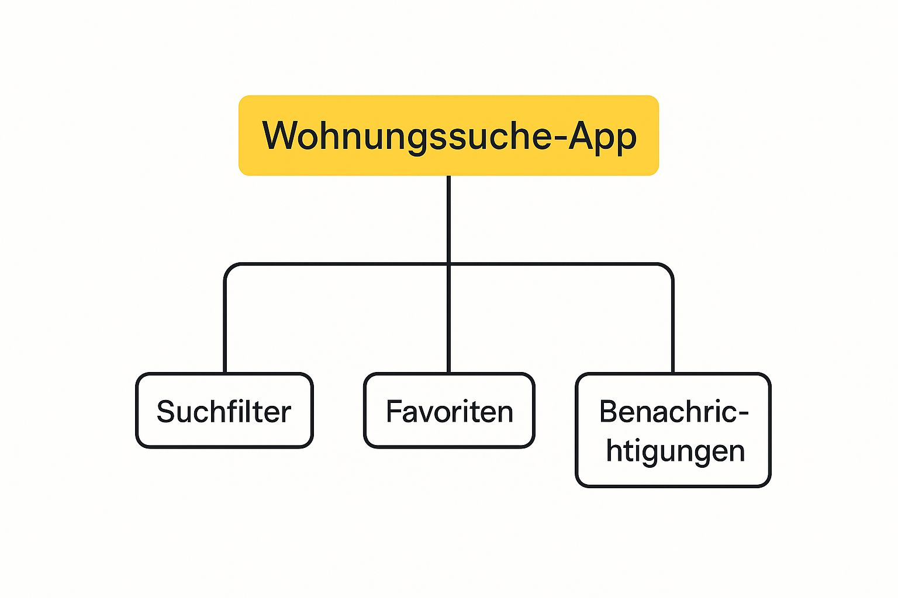

Die beste **App für die Wohnungssuche** ist heute viel mehr als ein digitales schwarzes Brett – sie ist dein Joker auf einem umkämpften Wohnungsmarkt. Eine richtig gute App spült dir neue Angebote in *Echtzeit* auf dein Smartphone, hilft dir beim Filtern und macht deine Bewerbung so einfach, dass du schneller als die Konkurrenz bist.

## Warum die richtige App bei der Wohnungssuche alles verändert

Die Zeiten, in denen du dicke Zeitungen wälzen oder Dutzende Makler-Websites abklappern musstest, sind zum Glück vorbei. Dein Smartphone ist jetzt dein wichtigstes Werkzeug, um eine Wohnung zu mieten oder ein Haus zu kaufen. Aber bei der riesigen Auswahl an Apps kann man schnell den Überblick verlieren.

Warum ist die Wahl der richtigen App also so entscheidend? Ganz einfach: Auf dem heutigen, unfassbar schnellen Immobilienmarkt verschafft sie dir den entscheidenden Vorteil, um schneller eine Wohnung zu finden.

> Stell dir die App wie deinen persönlichen Assistenten vor. Einen, der dich sofort anstupst, sobald eine passende Wohnung online geht – oft bevor andere sie überhaupt entdecken.

Sie ist so viel mehr als nur eine endlose Liste von Anzeigen. Sie ist dein Turbo, um die Suche effizienter und weniger nervenaufreibend zu gestalten.

### Der entscheidende Vorteil: Schnelligkeit und Ordnung

Gerade in gefragten Städten entscheiden oft Minuten darüber, ob du überhaupt eine Einladung zur Besichtigung bekommst. Und genau hier zeigen moderne Apps, was sie draufhaben:

- **Push-Nachrichten in Echtzeit:** Du erfährst als einer der Ersten, wenn eine Wohnung auftaucht, die genau auf dein Suchprofil passt.
- **Smarte Filter:** Anstatt dich durch Hunderte unpassende Angebote zu quälen, filterst du einfach nach dem, was dir wichtig ist – Balkon, Einbauküche, Haustiere erlaubt? Kein Problem.
- **Bewerbungen mit einem Klick:** Lade deine Unterlagen einmal hoch und schicke sie mit wenigen Klicks los. Das spart unglaublich viel Zeit und Stress.

Die angespannte Lage auf dem Wohnungsmarkt macht das Ganze noch wichtiger. Das aktuelle ImmoScout24 WohnBarometer zeigt, dass die Nachfrage nach Mietwohnungen bundesweit immer weiter steigt. Besonders stark ist der Anstieg in Mittelstädten mit **+210 %** seit 2021. Mehr zu den [Entwicklungen auf dem deutschen Wohnungsmarkt](https://www.immobilienscout24.de/wohnbarometer.html) kannst du dort nachlesen. In so einem Umfeld ist eine App, die dir hilft, schnell und organisiert zu sein, kein nettes Extra mehr, sondern absolute Pflicht.

## Funktionen, die eine gute Wohnungs-App ausmachen

Was unterscheidet eine mittelmäßige von einer wirklich hilfreichen **App für die Wohnungssuche**? Es sind die kleinen, aber feinen Details, die dir am Ende unzählige Stunden und Nerven sparen. Die besten Apps sind heute weit mehr als nur eine simple Suchmaske – sie sind dein persönlicher Assistent bei der Jagd nach deiner Traumwohnung.

Vergiss das endlose Durchforsten unpassender Angebote. Wir reden hier von smarten Push-Benachrichtigungen, die dich sofort alarmieren, sobald eine Wohnung online geht, die exakt zu deinen Wünschen passt. So gehörst du zu den Ersten, die reagieren – ein unschätzbarer Vorteil in umkämpften Städten.

### Mehr als nur suchen und finden

Eine erstklassige App denkt für dich mit. Sie gibt dir clevere Werkzeuge an die Hand, die den gesamten Prozess von der Suche bis zur Bewerbung einfacher und schneller machen.

Im Grunde stützt sich eine gute App auf drei wesentliche Säulen, wie du hier siehst:

Die Mischung aus präzisen Filtern, einer klaren Favoritenverwaltung und sofortigen Benachrichtigungen ist das Fundament für eine erfolgreiche Suche.

Aber das ist erst der Anfang. Richtig genial wird es, wenn du gezielt nach Details wie „Balkon“, „Einbauküche“ oder „Haustiere erlaubt“ filtern kannst. Eine intuitive Kartenansicht hilft dir außerdem dabei, die Lage und das Umfeld einer Wohnung auf einen Blick zu erfassen – ohne dass du umständlich die Adresse bei Google Maps eintippen musst.

Ein weiteres entscheidendes Feature ist die Option, deine digitale Bewerbungsmappe direkt in der App zu hinterlegen. So hast du alle Unterlagen sofort parat und kannst sie mit einem Klick an den Vermieter schicken.

> Eine gut vorbereitete App ist wie ein perfekt gepackter Koffer für die Besichtigung: Du bist jederzeit startklar und hinterlässt sofort einen professionellen Eindruck.

Die einfache Bedienung ist dabei ein absolutes Muss. Das bestätigen auch unabhängige Tests. Eine große Verbraucherbefragung im Auftrag von ntv kürte beispielsweise die [immowelt](https://www.immowelt.de/) App zum Testsieger, weil Nutzer die intuitiven Filter und interaktiven Karten besonders schätzten. Mehr zu den [Ergebnissen des Deutschen App-Awards](https://www.immowelt.de/ratgeber/news/deutscher-app-award-2025-immowelt-hat-die-beste-immobilien-app) kannst du hier nachlesen.

### Diese App-Funktionen sparen dir Zeit und Nerven

Die folgende Tabelle zeigt dir die wichtigsten Funktionen moderner Wohnungs-Apps und erklärt, wie du sie zu deinem Vorteil nutzt.

| Funktion | Dein Nutzen | Profi-Tipp zur Anwendung |
| :-- | :-- | :-- |
| **Push-Benachrichtigungen** | Du erfährst als Erster von neuen Angeboten und hast einen klaren Zeitvorteil gegenüber anderen Suchenden. | Aktiviere Benachrichtigungen nur für wirklich passende Suchanfragen. Zu viele Alarme führen dazu, dass du die wichtigen übersiehst. |
| **Präzise Filter** | Du siehst nur Wohnungen, die wirklich zu deinen Kriterien (z. B. Balkon, Etage, Haustiere) passen und verschwendest keine Zeit. | Nutze die „Ausschluss“-Filter, falls vorhanden. So kannst du z. B. Erdgeschosswohnungen von vornherein ausblenden. |
| **Digitale Bewerbungsmappe** | Du kannst deine Unterlagen (SCHUFA, Gehaltsnachweise) direkt aus der App versenden und sofort auf Anfragen reagieren. | Halte deine Dokumente immer aktuell. Ein veralteter Gehaltsnachweis kann deine Bewerbung ausbremsen. |
| **Favoriten & Notizen** | Du kannst interessante Wohnungen speichern, Notizen hinzufügen und so den Überblick über deine Top-Kandidaten behalten. | Lege eine klare Struktur fest. Nummeriere deine Favoriten oder nutze Emojis, um Prioritäten zu kennzeichnen (z. B. 🥇 für den Top-Favoriten). |
| **Interaktive Karte** | Du kannst die Lage, die Anbindung an öffentliche Verkehrsmittel und die Infrastruktur (Supermärkte, Parks) direkt in der App checken. | Nutze die Kartenansicht, um gezielt in bestimmten Vierteln oder entlang deiner Pendelstrecke zur Arbeit zu suchen. |

Wenn du diese Funktionen konsequent einsetzt, wird deine Wohnungssuche nicht nur deutlich effizienter, sondern auch viel weniger stressig.

## Welche Wohnungs-Apps gibt es? Ein kleiner Überblick

Wenn du dich auf die Suche nach einer neuen Wohnung machst, wirst du schnell merken: Der App-Markt wird von ein paar großen Anbietern dominiert. Aber welche **App für die Wohnungssuche** ist die richtige für dich? Lass uns einen Blick auf die bekanntesten Kandidaten werfen und schauen, was sie wirklich können.

Die Giganten, an denen keiner vorbeikommt, sind natürlich **[ImmoScout24](https://www.immobilienscout24.de/)** und **[Immowelt](https://www.immowelt.de/)**. Du kannst sie dir wie die riesigen Supermärkte der Immobilienbranche vorstellen. Hier findest du einfach alles, egal ob du eine Wohnung mieten oder ein Haus kaufen möchtest. Der größte Pluspunkt ist ganz klar die schiere Masse an Inseraten. Gleichzeitig ist das aber auch der größte Nachteil: Auf eine Wohnung bewerben sich oft Hunderte von Leuten.

### Spezialisten für deine Nische

Abseits der großen Allrounder haben sich einige Apps auf ganz bestimmte Bedürfnisse spezialisiert. Je nachdem, was du suchst, sind sie oft die clevere Wahl.

- **[WG-Gesucht.de](https://www.wg-gesucht.de/):** Der absolute Platzhirsch, wenn es um ein Zimmer in einer Wohngemeinschaft geht. Kein anderer Anbieter hat hier auch nur annähernd so viele Angebote. Die Atmosphäre ist meistens auch viel lockerer.
- **[Kleinanzeigen](https://www.kleinanzeigen.de/s-immobilien/c195):** Ein echter Geheimtipp! Hier stolperst du oft über Inserate von privaten Vermietern. Das heißt: keine Maklergebühren und der Kontakt ist oft viel direkter und persönlicher.
- **Andere Nischen-Apps:** Es gibt auch kleinere, spezialisierte Plattformen für möblierte Wohnungen auf Zeit oder provisionsfreie Angebote. Wenn du also etwas ganz Bestimmtes suchst, lohnt sich die gezielte Suche nach so einem Spezialisten.

> Wichtig zu wissen: Jede Plattform hat ihr eigenes Publikum. Was in Hamburg super klappt, ist in einer Kleinstadt in Bayern vielleicht die falsche Wahl.

Du siehst schon, worauf das hinausläuft, oder? Um wirklich nichts zu verpassen, müsstest du eigentlich ständig zwischen drei, vier oder sogar mehr Apps hin- und herspringen. Das ist nicht nur nervig, sondern kostet auch unglaublich viel Zeit. Und genau an diesem Punkt kommt eine All-in-One-Lösung ins Spiel, die dir all diese Suchen an einem Ort zusammenfasst – und dich damit deutlich schneller ans Ziel bringt.

## Alle Portale an einem Ort? So funktioniert es

Wer schon mal eine Wohnung gesucht hat, kennt das Problem: Das totale Chaos. Du legst auf unzähligen Portalen Suchaufträge an, springst zwischen den Apps hin und her und verlierst irgendwann komplett den Faden, wo du dich schon beworben hast. Das kostet nicht nur viel Zeit, sondern auch jede Menge Nerven.

Stell dir aber mal vor, es gäbe eine clevere Lösung für dieses Durcheinander. Eine Art Schaltzentrale, in der du nur einen einzigen, perfekten Suchfilter einstellst – und dieser durchforstet dann automatisch die Angebote aller wichtigen Portale für dich. Kein ständiges App-Wechseln mehr, keine doppelte Arbeit.

### Wie sogenannte Aggregatoren deine Suche vereinfachen

Genau hier kommen Tools wie der [Immobilien Bot](https://www.immobilien-bot.de/) ins Spiel. Solche **Aggregatoren** sind im Grunde dein persönlicher Assistent für die Wohnungssuche. Statt dass du selbst jede Plattform einzeln abklapperst, nehmen sie dir diese mühsame Arbeit einfach ab.

> Du kannst dir einen Aggregator wie ein riesiges Fischernetz vorstellen. Anstatt dutzende kleiner Angeln auszuwerfen, wirfst du dieses eine Netz aus und fängst alles, was für dich wichtig ist – mit einem einzigen Wurf.

Diese Tools sammeln die Inserate von [ImmoScout24](https://www.immobilienscout24.de/), [Immowelt](https://www.immowelt.de/), [Kleinanzeigen](https://www.kleinanzeigen.de/) und vielen anderen Portalen und packen sie für dich an einen einzigen, übersichtlichen Ort. Die Vorteile sind klar:

- **Du sparst massig Zeit:** Statt fünf Apps zu checken, brauchst du nur noch eine. Die gewonnene Zeit kannst du besser nutzen, zum Beispiel um deine Bewerbung vorzubereiten.
- **Du verpasst keine Wohnung mehr:** Dir rutscht garantiert kein Inserat mehr durch, nur weil es auf einer Nischenplattform online ging, die du gar nicht kanntest.
- **Du behältst den Überblick:** Alle deine Favoriten, Notizen und Anfragen sind an einem Ort gesammelt. So weißt du immer genau, was der nächste Schritt ist.

Dieser Effizienz-Sprung ist dein entscheidender Vorteil, gerade in Städten, wo oft jede Minute zählt. Du reagierst nicht mehr nur, sondern agierst – und bist der Konkurrenz damit immer einen Schritt voraus. So wird die richtige **App für die Wohnungssuche** zu deiner Geheimwaffe.

## Deine Strategie für die erfolgreiche Suche

Die beste Technik und die schlauste **App für die Wohnungssuche** bringen nichts ohne die richtige Taktik. Gerade weil der Wohnungsmarkt so umkämpft ist, musst du clever vorgehen, um aus der Masse herauszustechen. Es geht darum, schneller, besser vorbereitet und am Ende einfach überzeugender zu sein.

Dein Suchprofil ist deine digitale Visitenkarte. Fülle die Felder in der App also sorgfältig aus und lade ein sympathisches Foto hoch. Das schafft sofort eine persönliche Ebene und macht bei Vermietern einen guten ersten Eindruck.

### Die goldene Mitte zwischen Präzision und Offenheit

Die richtigen Suchfilter sind das A und O. Du willst dich nicht durch Hunderte unpassende Angebote wühlen, aber gleichzeitig auch nicht deine Traumwohnung verpassen, nur weil sie vielleicht 5 m² kleiner ist als dein Filter erlaubt.

> Setze deine Filter clever: Bei absoluten Muss-Kriterien (wie Zimmeranzahl oder Maximalmiete) solltest du genau sein. Bei den „Wäre-schön-wenn“-Kriterien (wie die exakte Quadratmeterzahl oder ein Balkon) lass ruhig ein bisschen Spielraum.

Der Hauptgrund für den Stress bei der Suche ist der Mangel an Wohnraum. Eine Analyse hat ergeben, dass in Deutschland aktuell rund **550.000 Wohnungen fehlen**. Dieses Defizit macht schnelle und effiziente Suchmethoden umso wichtiger.

### Geschwindigkeit ist alles

Der wichtigste Faktor ist deine Reaktionszeit. Geht eine passende Anzeige online, zählt wirklich jede Minute. Hier sind zwei Dinge, die du sofort umsetzen solltest:

- **Komplette Bewerbungsmappe:** Halte deine digitale Bewerbungsmappe immer startklar. Dazu gehören ein kurzes Anschreiben, deine SCHUFA-Auskunft und die letzten Gehaltsnachweise. Lade alles in die App hoch, damit du es mit nur einem Klick verschicken kannst.
- **Professionelle erste Nachricht:** Bereite eine freundliche, professionelle Nachrichtenvorlage vor. Stell dich kurz vor und zeig, dass du wirklich interessiert bist. Eine persönliche Note, die kurz auf die Anzeige eingeht, hebt dich zusätzlich von der Konkurrenz ab.

Mit diesen Tipps bist du richtig gut aufgestellt. Gerade in Städten mit hoher Nachfrage ist eine durchdachte Strategie Gold wert. In unserem Guide zeigen wir dir zum Beispiel, wie du die [Wohnungssuche in Köln erfolgreich gestaltest](https://immobilien-bot.de/2025/08/27/wohnung-koln-suchen-2/).

## Sei schneller als die anderen und finde dein Zuhause

Halten wir fest: Eine moderne Wohnungssuche ohne die richtige **App** ist heute undenkbar. Du hast jetzt einen guten Überblick, welche Funktionen wirklich etwas bringen und wie du deine Suche so aufstellst, dass du am Ende den Mietvertrag in der Hand hältst.

Der Knackpunkt ist immer derselbe: Du musst den Überblick behalten und schneller sein als all die anderen Suchenden. Anstatt dich mühsam durch den Dschungel der einzelnen Portale zu klicken, kannst du mit einer cleveren All-in-One-Lösung den kompletten Markt auf dem Schirm haben. So findest du nicht nur leichter, sondern vor allem deutlich schneller dein neues Zuhause.

> Mache dir die Technik zum Freund und sei den anderen immer eine Nasenlänge voraus. Das ist kein nettes Extra mehr, sondern oft die Grundvoraussetzung für den Erfolg.

Mit der richtigen Vorbereitung und den passenden Tools wird dann auch die Besichtigung zum Heimspiel. Schau dir dazu doch mal unsere besten [Tipps für eine erfolgreiche Wohnungsbesichtigung](https://immobilien-bot.de/2025/08/27/wohnungsbesichtigung-tipps/) in unserem Ratgeber an.

### Welche App ist die beste für die Wohnungssuche?

Die eine „perfekte“ App für alle gibt es leider nicht, denn es kommt darauf an, was du suchst.

Die großen Platzhirsche wie [ImmoScout24](https://www.immobilienscout24.de/) und [Immowelt](https://www.immowelt.de/) haben die größte Auswahl. Wenn du aber ein WG-Zimmer suchst, führt kein Weg an [WG-Gesucht.de](https://www.wg-gesucht.de/) vorbei. Der cleverste Schachzug ist aber, ein Tool zu nutzen, das die Angebote von allen Portalen für dich zusammenfasst. So suchst du nur an einem Ort und verpasst trotzdem keine Annonce.

### Kostet die Wohnungssuche per App etwas?

Die gute Nachricht zuerst: Nein, die Grundfunktionen sind bei allen großen Anbietern kostenlos. Du kannst also nach Herzenslust stöbern und dir Wohnungen ansehen.

Aber: Viele Portale bieten kostenpflichtige Premium-Abos an (z.B. „MieterPlus“). Damit siehst du Anzeigen früher oder deine Bewerbung landet im Postfach des Vermieters ganz oben. In Städten mit extrem angespanntem Wohnungsmarkt kann das ein Vorteil sein, ist aber kein Muss.

### Wie wichtig ist eine digitale Bewerbungsmappe?

Kurz gesagt: **extrem wichtig**. Stell dir vor, du bist Vermieter und bekommst Hunderte Anfragen auf eine Wohnung. Eine komplette, ordentliche Mappe mit Anschreiben, Schufa-Auskunft und Einkommensnachweisen, die direkt mit der ersten Nachricht kommt, ist da Gold wert.

> Deine sofort griffbereite Bewerbungsmappe ist deine Eintrittskarte. Sie zeigt, dass du vorbereitet und ernsthaft interessiert bist – und hebt dich sofort von der Masse ab.

Damit hinterlässt du einen super ersten Eindruck und steigerst deine Chancen auf eine Besichtigung enorm.

### Sollte ich mehrere Apps gleichzeitig nutzen?

Auf jeden Fall! Nicht jeder Vermieter inseriert auf jedem Portal. Um also wirklich den ganzen Markt im Blick zu haben und deine Chancen zu maximieren, solltest du breit aufgestellt sein.

Das ständige Hin- und Herspringen zwischen den Apps kann aber ganz schön nerven. Viel schlauer ist es, einen sogenannten Aggregator zu nutzen, der dir die ganze Arbeit abnimmt und die Suchen für dich bündelt.

---

Mit dem **Immobilien Bot** scannst du alle relevanten Portale auf einen Schlag und bist damit oft schneller als alle anderen. [Finde jetzt dein neues Zuhause!](https://www.immobilien-bot.de)
