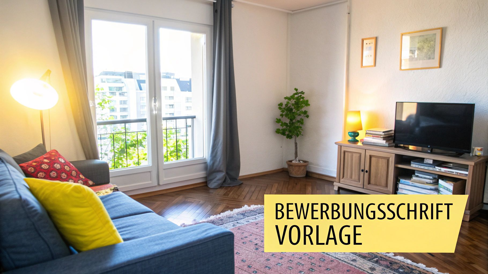
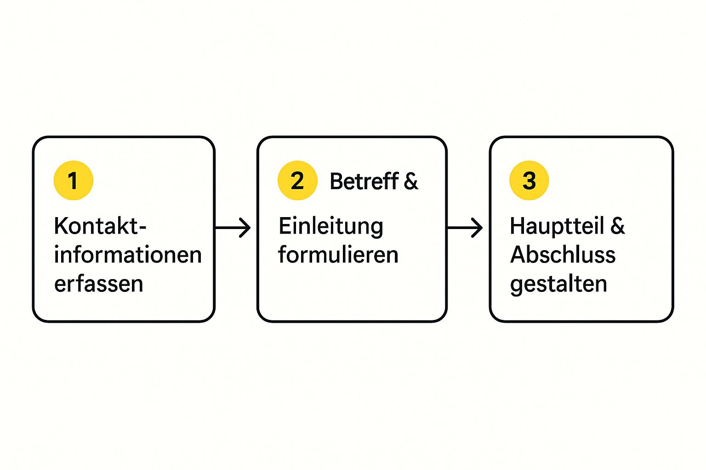

Klar, wer schon mal eine Wohnung gesucht hat, weiß: Auf den umkämpften Wohnungsmärkten reicht ein Standard-Anschreiben oft nicht mehr aus. Wenn du wirklich aus der Masse herausstechen und den Vermieter überzeugen willst, ist ein persönliches und gut durchdachtes Bewerbungsschreiben deine Eintrittskarte. Es ist oft das Zünglein an der Waage.

## Warum ein gutes Anschreiben den Unterschied macht

Du hast deine Traumwohnung gefunden? Super! Aber jetzt kommt der knifflige Teil: Du musst den Vermieter davon überzeugen, dass genau du die perfekte Besetzung bist.

Gerade in beliebten Städten zählt nicht nur, wie schnell du bist, sondern vor allem, wie gut deine Bewerbung ist. Ein liebloses 08/15-Schreiben landet bei Hunderten von Anfragen einfach auf dem „Nein“-Stapel.

Dein Bewerbungsschreiben ist so viel mehr als eine reine Formalität. Es ist deine erste – und oft einzige – Chance, einen wirklich guten Eindruck zu hinterlassen. Hier kannst du eine persönliche Note reinbringen, die in einer trockenen Selbstauskunft komplett verloren geht.

### Die Sorgen von Vermietern verstehen

Um wirklich zu überzeugen, musst du dich in die Lage des Vermieters versetzen. Was treibt ihn um? Im Grunde sind es immer die gleichen drei großen Sorgen:

- **Zahlt der Mieter pünktlich?** Die größte Angst ist natürlich der Mietausfall.
- **Geht er gut mit der Wohnung um?** Niemand will nach ein paar Jahren eine heruntergekommene Bude zurück.
- **Stört er die Hausgemeinschaft?** Ärger mit den Nachbarn will jeder Vermieter vermeiden.

Ein cleveres Anschreiben nimmt dem Vermieter diese Sorgen direkt ab. Es zeigt nicht nur, dass du dir die Miete leisten kannst, sondern auch, dass du ein verantwortungsbewusster und rücksichtsvoller Mensch bist.

> Ein gutes Anschreiben ist wie ein fester Händedruck – es schafft sofort Vertrauen und signalisiert Zuverlässigkeit. Es zeigt, dass du dir Mühe gibst und die Wohnung wirklich willst.

### Im Wettbewerb die Nase vorn haben

Die aktuelle Situation auf dem Wohnungsmarkt macht die Sache nicht einfacher. In ganz Deutschland wurden beispielsweise für das Jahr 2024 nur rund **216.000 Baugenehmigungen** erteilt – ein historischer Tiefstand. Weniger Neubau bedeutet automatisch mehr Konkurrenz um die Wohnungen, die es schon gibt. Mehr zu dieser Entwicklung findest du bei den [Statistiken zu Baugenehmigungen auf de.statista.com](https://de.statista.com/statistik/daten/studie/1340287/umfrage/baugenehmigungen-fuer-wohnungen-in-deutschland/).

In so einem Umfeld wird dein Anschreiben zum entscheidenden Faktor. Hier kannst du zeigen, wer du bist, wie zuverlässig du bist und warum du dich für genau diese Wohnung begeisterst. Mit den richtigen Worten vermittelst du dem Vermieter, dass er mit dir einen unkomplizierten und hoffentlich langfristigen Mieter bekommt. Und genau das hebt dich von den anderen ab.

## So baust du dein Anschreiben überzeugend auf

Ein gutes Anschreiben braucht eine klare Struktur. Ohne einen roten Faden wirkt dein Text schnell chaotisch und landet direkt auf dem Absagestapel. Also, lass uns gemeinsam dein Bewerbungsschreiben Schritt für Schritt aufbauen, damit jede Information sitzt und der Vermieter einen super ersten Eindruck von dir bekommt.

Ein überzeugender Aufbau folgt dabei immer einer ganz logischen Reihenfolge: Kontaktinfos, eine knackige Betreffzeile, eine persönliche Einleitung, ein informativer Hauptteil und ein freundlicher Abschluss.

Die folgende Infografik zeigt dir diesen bewährten Ablauf auf einen Blick.

Wie du siehst, führt ein klarer Weg vom ersten Kontakt bis zum fertigen Dokument, das einen professionellen und sympathischen Eindruck hinterlässt.

### Deine Kontaktdaten und die des Vermieters

Ganz oben, wie bei einem klassischen Brief, stehen deine vollständigen Kontaktdaten: Name, Adresse, Telefonnummer und E-Mail-Adresse. Direkt darunter platzierst du die Daten des Vermieters oder der Hausverwaltung.

Falls du keinen direkten Ansprechpartner findest, reicht auch die allgemeine Adresse. Kleiner Profi-Tipp: Ein kurzer Anruf, um den Namen der zuständigen Person zu erfragen, zeigt Initiative und ermöglicht dir eine viel persönlichere Anrede. Das kommt immer gut an.

### Der Betreff bringt es auf den Punkt

Die Betreffzeile muss sofort alle wichtigen Infos liefern. Vermieter jonglieren oft mit Dutzenden Anfragen für mehrere Objekte gleichzeitig. Mach es ihnen so einfach wie möglich!

Ein guter Betreff enthält immer:

- **Den Grund deines Schreibens:** „Bewerbung um die Wohnung“
- **Die genaue Bezeichnung:** z. B. „3-Zimmer-Wohnung im 2. OG“
- **Die Adresse:** „Musterstraße 12, 12345 Musterstadt“
- **Die Kennziffer aus dem Inserat:** falls vorhanden, z. B. „Referenznummer: 123-ABC“

Ein präziser Betreff zeigt, dass du sorgfältig bist und dem Vermieter wertvolle Zeit sparst. Das ist ein riesiger Pluspunkt.

### Einleitung und Hauptteil – das Herzstück deiner Bewerbung

Nach einer persönlichen Anrede wie „Sehr geehrte Frau Mustermann“ folgt eine kurze, sympathische Einleitung. Hier erzählst du, wo du die Anzeige gesehen hast und bekundest dein großes Interesse. Lass die Floskeln weg und komm direkt zur Sache.

Im Hauptteil stellst du dich und eventuelle Mitbewohner vor. Wer seid ihr? Was macht ihr beruflich? Und ganz wichtig: Warum sucht ihr eine neue Wohnung? Dieser Teil ist deine Chance, Persönlichkeit zu zeigen und eine Verbindung aufzubauen. Erkläre kurz, warum genau *diese* Wohnung perfekt für deine aktuelle Lebenssituation ist.

> Zeige echte Begeisterung für Details der Wohnung. Erwähne den schönen Balkon oder die Nähe zum Park – das signalisiert, dass du dich wirklich mit dem Angebot auseinandergesetzt hast und nicht nur eine Massen-Mail verschickst.

Direkt im Anschluss sprichst du deine finanzielle Situation an. Erwähne dein **gesichertes und unbefristetes Arbeitsverhältnis** und dein monatliches Nettoeinkommen. Das schafft sofort Vertrauen und nimmt dem Vermieter eine seiner größten Sorgen. Betone auch dein Interesse an einem langfristigen Mietverhältnis – das hören Vermieter am liebsten.

Diese Tabelle fasst die wesentlichen Bestandteile eines überzeugenden Anschreibens zusammen und gibt dir konkrete Tipps für jeden Abschnitt.

**Aufbau des perfekten Bewerbungsschreibens für eine Wohnung**

| Abschnitt | Inhalt & Ziel | Beispielformulierung |
| :-- | :-- | :-- |
| **Kontaktdaten** | Deine vollständigen Daten (Name, Adresse, Tel., Mail) und die des Vermieters. | *Platzierung oben links (Absender) und darunter (Empfänger)* |
| **Betreff** | Alle relevanten Infos auf einen Blick: Wohnung, Adresse, Kennziffer. | „Bewerbung um die 3-Zimmer-Wohnung in der Musterstraße 12, Kennziffer: 123-ABC“ |
| **Anrede** | Immer persönlich, wenn möglich. Zeigt, dass du recherchiert hast. | „Sehr geehrte Frau Mustermann,“ |
| **Einleitung** | Kurzer Bezug zur Anzeige und klare Interessensbekundung. | „Mit großem Interesse habe ich Ihre Anzeige für die Wohnung in der Musterstraße auf ImmoScout24 gesehen.“ |
| **Hauptteil** | Vorstellung deiner Person/Familie, Beruf, Einkommen, Grund für Umzug. | „Mein Name ist Max Mustermann, ich bin 32 Jahre alt und arbeite als Softwareentwickler in einem unbefristeten Arbeitsverhältnis bei der Tech-Firma GmbH.“ |
| **Abschluss** | Dank, Vorfreude auf Besichtigung, Hinweis auf Anlagen. | „Über eine Einladung zu einem Besichtigungstermin würde ich mich sehr freuen. Meine vollständigen Bewerbungsunterlagen finden Sie im Anhang.“ |
| **Grußformel & Unterschrift** | Freundlich und professionell. | „Mit freundlichen Grüßen, Max Mustermann“ |

Mit dieser Struktur im Kopf bist du bestens vorbereitet, um einen bleibenden, positiven Eindruck zu hinterlassen.

### Ein positiver Abschluss rundet alles ab

Beende dein Schreiben mit einem freundlichen und zuversichtlichen Schlusssatz. Bedanke dich für die Zeit und erwähne, dass du dich auf eine Einladung zur Besichtigung freust. Manchmal findet diese heutzutage auch digital statt; mehr darüber erfährst du in unserem Ratgeber zur [Online-Wohnungsbesichtigung](https://immobilien-bot.de/2025/09/13/online-wohnungsbesichtigung/).

Vergiss nicht, am Ende auf deine vollständigen Bewerbungsunterlagen im Anhang hinzuweisen. Eine freundliche Grußformel wie „Mit freundlichen Grüßen“ und deine (digitale) Unterschrift schließen das Dokument sauber ab.

## Unsere Vorlage für dein Bewerbungsschreiben

Theorie ist ja ganz nett, aber wenn es schnell gehen muss, zählt vor allem die Praxis. Deswegen haben wir hier eine praxiserprobte **Bewerbungsschreiben für Wohnung Vorlage** für dich, die du einfach schnappen, anpassen und losschicken kannst.

Aber statt dir nur ein leeres Gerüst hinzuwerfen, haben wir gleich ein paar ausformulierte Beispiele für verschiedene Lebenslagen parat. Jede Wohnungssuche ist schließlich anders.

### Die richtigen Worte für jede Lebenssituation

Egal, ob du als Studi deine erste eigene Bude suchst, als junge Familie dringend mehr Platz brauchst oder als Paar die erste gemeinsame Wohnung planst – jede Ausgangslage braucht einen etwas anderen Dreh. Ein Student sollte vielleicht erwähnen, dass die Eltern bürgen, während eine Familie die ruhige, kinderfreundliche Lage hervorheben kann.

Unsere Beispiele sollen dir helfen, deine ganz persönliche Geschichte so zu erzählen, dass sie authentisch und überzeugend rüberkommt.

Hier sind ein paar typische Szenarien, für die wir dir die passenden Formulierungen liefern:

- **Für Studierende & Azubis:** Wie du trotz schmalem Budget mit einer Bürgschaft oder einem soliden Nebenjob punktest.
- **Für junge Familien:** Wie du den Wunsch nach einem langfristigen Zuhause und den Platzbedarf sympathisch begründest.
- **Für Singles mit Haustier:** Wie du deinen Vierbeiner ins beste Licht rückst und zeigst, dass du ein verantwortungsvoller Halter bist.
- **Für Paare:** Wie ihr euch als zuverlässiges Doppelpack mit zwei gesicherten Einkommen präsentiert.

Diese Vorlagen sollen dir die Unsicherheit nehmen und wertvolle Zeit sparen. So kannst du dich auf das konzentrieren, was wirklich zählt: deine Traumwohnung zu finden.

> Der Trick ist, deine Situation nicht als Schwäche zu sehen, sondern als Teil deiner Geschichte. Offen mit einem befristeten Arbeitsvertrag umzugehen und gleichzeitig die hohe Übernahmechance zu erwähnen, kommt zum Beispiel viel besser an, als Fakten zu verschweigen.

Der Druck ist hoch, das spüren wir alle. Aktuelle Analysen bestätigen, dass in Deutschland rund **550.000** Wohnungen fehlen. Das liegt nicht nur am schleppenden Neubau, sondern auch daran, dass oft am Bedarf vorbeigeplant wird – riesige Luxuswohnungen statt kleiner, bezahlbarer Einheiten. Wenn du tiefer einsteigen willst, findest du mehr dazu [in diesem Endbericht zum Wohnungsbau](https://mieterbund.de/app/uploads/2025/04/Endbericht_Wohnungsbau-2025-_Quo-vadis_Stand-01.04.2025.pdf). Genau dieser Mangel macht ein gut durchdachtes Anschreiben noch wichtiger, um überhaupt eine Chance zu haben.

Und denk dran: Eine gute **Bewerbungsschreiben für Wohnung Vorlage** ist kein starres Formular. Sieh sie als Starthilfe, fülle sie mit Leben und Persönlichkeit und hinterlasse einen bleibenden Eindruck.

## Diese Fehler können dich die Traumwohnung kosten

Du hast Stunden in dein Anschreiben und die Unterlagen gesteckt – und dann kann ein winziger Fehler alles kaputtmachen. Gerade in Städten, wo sich hunderte Leute auf eine Wohnung bewerben, entscheiden oft Kleinigkeiten. Schauen wir uns mal die häufigsten Stolperfallen an, damit deine Bewerbung nicht direkt auf dem „Nein“-Stapel landet.

Der absolute Klassiker unter den Fehlern ist das unpersönliche Massenanschreiben. Sätze wie „Sehr geehrte Damen und Herren, ich interessiere mich für Ihre Wohnung“ schreien förmlich danach, dass du dieselbe Mail an 20 andere Vermieter rausgehauen hast. Nimm dir die zwei Minuten extra, um den richtigen Ansprechpartner rauszufinden. Das zeigt echtes Interesse und Respekt – und hebt dich sofort von der Masse ab.

### Flüchtigkeitsfehler und falsche Angaben

Rechtschreib- und Grammatikfehler sind keine kleinen Schönheitsfehler, sie sind ein echtes Warnsignal. Sie vermitteln einen schlampigen Eindruck. Die Frage, die sich Vermieter dann sofort stellen: Wenn du dich schon bei der Bewerbung nicht bemühst, wie gehst du dann erst mit der Wohnung um?

Lies deinen Text also lieber dreimal als einmal zu wenig. Lass ihn auch mal einen Tag liegen und schau dann mit frischen Augen drüber. Oder noch besser: Lass einen Freund oder eine Freundin mal schnell drüberlesen. Ein sauberer Text ist der einfachste Weg, einen professionellen Eindruck zu hinterlassen.

Genauso schlimm sind falsche Angaben oder das bewusste Weglassen wichtiger Infos. Hier sind die absoluten No-Gos:

- **Beim Einkommen flunkern:** Das fliegt spätestens bei den Gehaltsnachweisen auf und das Vertrauen ist sofort futsch.
- **Mitbewohner oder Haustiere verschweigen:** Wenn plötzlich ein Hund in der Wohnung auftaucht, von dem nie die Rede war, ist das ein handfester Kündigungsgrund. Sei von Anfang an ehrlich, das erspart allen Beteiligten Ärger.
- **Unvollständige Unterlagen schicken:** Fehlende Dokumente bedeuten für den Vermieter nur extra Arbeit und lassen dich total unorganisiert dastehen.

> Ehrlichkeit ist das Fundament für jedes gute Mietverhältnis. Ein bisschen beim Einkommen aufzurunden oder den Dackel zu verschweigen mag verlockend klingen, führt aber fast immer zu riesigen Problemen. Das kann dich die Wohnung kosten, bevor du überhaupt den Schlüssel in der Hand hattest.

### Der Ton macht die Musik – und die Bonität auch

Ein zu lockerer Tonfall („Hey, wollt mal fragen, ob die Bude noch zu haben ist?“) ist genauso fehl am Platz wie ein ultra-steifes, unpersönliches Schreiben. Versuch, eine freundliche, respektvolle und trotzdem persönliche Mitte zu finden. Du bewirbst dich schließlich um ein Zuhause, nicht um einen Platz im Party-Keller.

Ein weiterer entscheidender Punkt ist deine Bonität. Eine negative SCHUFA-Auskunft ist für viele Vermieter ein K.O.-Kriterium. Kümmer dich also frühzeitig darum und check deine Einträge. Wie du sicherstellst, dass deine Finanzen im besten Licht dastehen, erfährst du in unserem Ratgeber über die [positive SCHUFA-Auskunft](https://immobilien-bot.de/2025/09/12/schufa-auskunft-positiv/). Sei proaktiv – das zeigt, dass du deine Finanzen im Griff hast.

## Deine Checkliste für eine lückenlose Bewerbungsmappe

Super, dein Anschreiben hat Interesse geweckt! Aber das ist oft nur die halbe Miete. Um wirklich zur Besichtigung eingeladen zu werden, brauchst du eine komplette Bewerbungsmappe. Sie ist der handfeste Beweis dafür, dass du nicht nur nett klingst, sondern auch ein absolut zuverlässiger und zahlungsfähiger Mieter bist.

Stell dir die Mappe wie deine Visitenkarte vor. Ist sie ordentlich, vollständig und übersichtlich, hinterlässt du sofort einen professionellen Eindruck. Damit dabei nichts schiefgeht, habe ich hier die ultimative Checkliste für dich.

### Diese Unterlagen müssen rein

Mach es dem Vermieter so einfach wie möglich. Wenn du alle wichtigen Dokumente direkt mitschickst, ersparst du ihm Nachfragen und zeigst, dass du top vorbereitet bist.

- **Das persönliche Anschreiben:** Das ist dein Türöffner, leg es immer ganz nach oben.
- **Die Mieterselbstauskunft:** Ein Formular, in dem du die wichtigsten Infos zu dir, deinem Job und deinem Einkommen einträgst. Wichtig: Immer bei der Wahrheit bleiben!
- **Aktuelle Einkommensnachweise:** Meistens wollen Vermieter die **letzten drei Gehaltsabrechnungen** sehen. Bist du selbstständig, sind es oft die letzte BWA oder der Einkommensteuerbescheid.
- **Eine aktuelle SCHUFA-Auskunft:** Ohne geht fast nichts mehr. Dieses Dokument zeigt deine Bonität und ist für Vermieter ein absolutes Muss.
- **Eine Mietschuldenfreiheitsbescheinigung:** Ein kurzes Schreiben von deinem jetzigen Vermieter, das bestätigt, dass du deine Miete immer pünktlich bezahlt hast.

> Eine komplette Mappe ist mehr als nur eine Formalität. Sie zeigt dem Vermieter, dass du seine Zeit respektierst. Wenn er alle Infos auf einen Blick hat, landest du auf dem Stapel automatisch weiter oben.

Gerade in den Großstädten ist der Wohnungsmarkt extrem umkämpft. Aktuelle Zahlen zeigen, dass allein in den 77 größten Städten rund **1,9 Millionen** bezahlbare Wohnungen fehlen – das macht den Wettbewerb natürlich hart. Mehr dazu kannst du im Artikel über die [aktuelle Wohnungsnot in Deutschland auf boeckler.de](https://www.boeckler.de/de/auf-einen-blick-17945-20782.htm) nachlesen. Eine saubere, vollständige Mappe ist da oft das Zünglein an der Waage.

### Mein Profi-Tipp für die digitale Bewerbung

Heute läuft fast alles online. Der größte Fehler, den du machen kannst? Fünf einzelne E-Mail-Anhänge zu verschicken. Fass stattdessen **alle Dokumente in einer einzigen, gut sortierten PDF-Datei** zusammen.

Gib der Datei einen klaren Namen, zum Beispiel so: „Bewerbung_Musterstraße12_Max_Mustermann.pdf“. Das wirkt aufgeräumt und der Vermieter weiß sofort, wohin er die Datei packen muss. Wenn du noch mehr ins Detail gehen willst, schau dir unseren Guide für die perfekte [Bewerbungsmappe für die Wohnung](https://immobilien-bot.de/2025/09/17/bewerbungsmappe-wohnung-vorlage/) an. Dort findest du auch Vorlagen und weitere Tipps.

## Fragen, die immer wieder aufkommen (FAQ)

Du hast noch Fragen im Kopf? Perfekt, das ist ganz normal. Die Wohnungssuche ist eben keine Massenabfertigung und jede Situation ist ein bisschen anders. Lass uns mal die häufigsten Stolpersteine aus dem Weg räumen, damit du auf alles vorbereitet bist.

### "Mein Einkommen ist niedrig oder ich bin arbeitslos – was tun?"

Ganz wichtig: Spiel mit offenen Karten. Deine Situation zu verschweigen, fliegt dir früher oder später um die Ohren. Sei stattdessen transparent und erkläre deine finanzielle Lage.

Wenn du zum Beispiel Bürgergeld bekommst, hat das für den Vermieter einen entscheidenden Vorteil: Die Miete kommt pünktlich und direkt vom Amt. Das ist eine Sicherheit, die viele andere Bewerber nicht bieten können – also hebe das unbedingt hervor!

Um deine Chancen noch weiter zu pushen, ist ein Bürge Gold wert. Das können deine Eltern sein oder andere enge Verwandte. Leg die unterschriebene **Bürgschaftserklärung** am besten direkt mit in deine Unterlagen. Das zeigt, dass du mitgedacht hast und zuverlässig bist. Und vergiss nicht deine anderen Stärken: Du bist ein ruhiger Mieter, Nichtraucher oder hast keine Haustiere? Das sind alles echte Pluspunkte!

### "Muss ich ein Foto von mir mitschicken?"

Das ist eine sehr persönliche Entscheidung, da gibt es kein klares Ja oder Nein. Ein sympathisches Foto kann deiner Bewerbung ein Gesicht geben und eine persönliche Ebene schaffen. Aber klar ist auch: Es ist **absolut keine Pflicht**.

Rein rechtlich darf nach dem Allgemeinen Gleichbehandlungsgesetz (AGG) kein Foto verlangt werden, um niemanden zu diskriminieren. Falls du dich aber dafür entscheidest, nimm bitte ein professionelles, freundliches Porträtfoto. Das Urlaubs-Selfie vom Strand bleibt besser im Handy-Album.

### "Wie bewerben wir uns als WG am besten?"

Als Wohngemeinschaft müsst ihr beweisen, dass ihr ein organisiertes und verlässliches Team seid. Schreibt ein gemeinsames Anschreiben, in dem ihr euch als Gruppe vorstellt.

- Wer seid ihr? Stellt jedes Mitglied kurz vor (Name, Alter, Beruf/Studium).
- Warum passt ihr gut zusammen? Erklärt kurz, warum eure WG harmoniert.
- Warum genau diese Wohnung? Zeigt, dass ihr euch mit dem Inserat beschäftigt habt.

> Das A und O für den Vermieter ist die finanzielle Sicherheit. Jedes WG-Mitglied, das später als Hauptmieter im Vertrag stehen soll, muss lückenlose Bonitätsnachweise vorlegen. Das heißt: Einkommensnachweise und eine aktuelle SCHUFA-Auskunft von jeder einzelnen Person sind Pflicht.

Macht deutlich, dass ihr keine Zweck-WG seid, bei der ständig die Leute wechseln, sondern eine verantwortungsbewusste Gruppe, die sich um die Wohnung kümmern wird. Das schafft Vertrauen und nimmt dem Vermieter viele Sorgen.

### "Wie lang darf das Anschreiben eigentlich sein?"

Fass dich kurz. Ernsthaft. Die goldene Regel lautet: **Eine DIN-A4-Seite ist das absolute Maximum.** Vermieter haben oft nur ein paar Minuten pro Bewerbung. Ein Roman wird da garantiert nicht bis zum Ende gelesen.

Konzentrier dich auf das Wesentliche und bring es auf den Punkt. Eine klare Struktur mit kurzen Absätzen, so wie wir es hier im Ratgeber zeigen, ist der beste Weg. Du willst schnell und sympathisch überzeugen, nicht den Literatur-Nobelpreis gewinnen.

---

Keine Lust mehr, die Traumwohnung zu verpassen, nur weil du einen Tag zu langsam warst? Der **Immobilien Bot** durchsucht für dich alle Portale gleichzeitig und schickt dir neue Angebote sofort zu. Finde deine nächste Wohnung schneller und einfacher auf [https://www.immobilien-bot.de](https://www.immobilien-bot.de).
