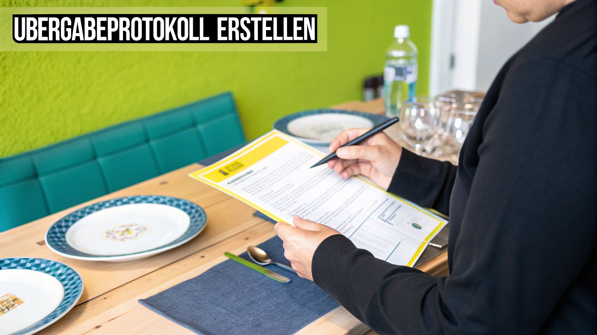

Du hast deine Traumwohnung gefunden und der Vormieter möchte dir die Küche oder andere Möbel überlassen? Super, das kann dir eine Menge Umzugsstress ersparen und manchmal ist sogar ein echtes Schnäppchen dabei. Damit aber aus diesem freundlichen Angebot kein Albtraum wird, ist ein *Vertrag zur Möbelübernahme* Gold wert. So wird aus einem schnellen Handschlag eine sichere Sache für euch beide.

## Warum ein schriftlicher Vertrag zur Möbelübernahme ein Muss ist

Klar, eine mündliche Zusage gilt theoretisch auch. Aber was, wenn der Kühlschrank, der bei der Besichtigung noch lief, beim Einzug plötzlich den Geist aufgibt? Oder der Vormieter auf einmal einen ganz anderen Preis im Kopf hat als besprochen? Ohne etwas Schriftliches stehst du da schnell im Regen und kannst deine Rechte kaum beweisen.

Ein schriftlicher Vertrag ist quasi deine Versicherung. Er schafft von Anfang an klare Verhältnisse und lässt keinen Raum für blöde Missverständnisse.

Hier haltet ihr die wichtigsten Dinge fest:

- **Was genau übernimmst du?** Listet jedes einzelne Möbelstück und Gerät auf. Das verhindert spätere Diskussionen à la "Der Hängeschrank gehörte doch dazu!".
- **Wie ist der Zustand?** Dokumentiert vorhandene Macken oder Kratzer. So kann dir später niemand unterstellen, du hättest etwas beschädigt.
- **Was kostet der Spaß?** Der vereinbarte Kaufpreis gehört schwarz auf weiß ins Dokument.
- **Wann wird bezahlt und übergeben?** Feste Termine geben dir und dem Vormieter Planungssicherheit.

> Ein sauber aufgesetzter Vertrag ist kein Misstrauensbeweis – ganz im Gegenteil. Er zeigt, dass ihr beide die Sache ernst nehmt und fair miteinander umgehen wollt. So startest du ohne unnötigen Ärger in dein neues Zuhause.

Man unterschätzt leicht, was Möbel wert sein können. Allein 2023 haben die Deutschen satte **51,4 Milliarden Euro für Möbel** und Einrichtung ausgegeben. Diese Zahl macht deutlich, dass auch gebrauchte Stücke einen erheblichen Wert haben können – und warum es so wichtig ist, eine Übernahme ordentlich abzusichern. Wer es genauer wissen will, kann sich die Zahlen zur Möbelbranche auf Statista ansehen.

Gerade bei der Wohnungssuche, wo es oft um viel Geld und Vertrauen geht, solltest du alle Vereinbarungen genau unter die Lupe nehmen. Apropos Finanzen: In unserem Artikel erklären wir dir, [was eine Bonitätsauskunft ist](https://immobilien-bot.de/2025/08/31/was-ist-eine-bonitatsauskunft/) und warum sie für Vermieter so wichtig ist. Mit einem soliden Übernahmevertrag in der Tasche kannst du der Verhandlung mit dem Vormieter ganz entspannt entgegensehen.

## Was in deinem Vertrag zur Möbelübernahme stehen muss

Ein solider **Vertrag zur Übernahme von Möbeln** ist Gold wert. Er schafft klare Verhältnisse und schützt dich genauso wie den Verkäufer. Damit du bei der Erstellung nichts übersiehst, gehen wir jetzt mal Schritt für Schritt durch, was da unbedingt rein muss. Ziel ist es, von Anfang an Missverständnisse zu vermeiden, damit die ganze Aktion glatt über die Bühne geht.

Ganz grundlegend, aber super wichtig: Die vollständigen Namen und aktuellen Adressen von dir (dem Käufer) und dem Vormieter (dem Verkäufer) müssen rein. Damit ist von vornherein glasklar, wer hier eigentlich eine Vereinbarung trifft.

### Die Möbelstücke ganz genau beschreiben

Das Herzstück des Vertrags ist die Liste der Gegenstände, die du übernimmst. Sei hier so präzise wie nur möglich. Schreib nicht einfach nur „Einbauküche“, sondern geh ins Detail. Eine exakte Beschreibung verhindert später Zoff darüber, was nun eigentlich zum Deal gehörte und was nicht.

So machst du es richtig:

- **Jedes Teil einzeln auflisten:** Also zum Beispiel „Hängeschrank, links neben dem Fenster“, „Backofen von Siemens, Modell XY“ oder „Bosch Kühlschrank, Serie 4“.
- **Den Zustand ehrlich festhalten:** Dokumentiere Mängel schwarz auf weiß. Das kann ein „kleiner Kratzer auf der Arbeitsplatte vorne rechts“ sein oder der Hinweis, dass „eine Schublade etwas schwergängig schließt“.
- **Fotos als Beweis:** Mach ein paar aussagekräftige Bilder von den Möbeln und vor allem von den erwähnten Mängeln. Die heftest du einfach als Anhang an den Vertrag. Das ist oft der beste Schutz gegen spätere Diskussionen.

Wenn du das so machst, wissen beide Seiten ganz genau, worauf sie sich einlassen. Die folgende Grafik zeigt dir nochmal den Ablauf, bevor du deine Unterschrift unter den fertigen Vertrag setzt.

Wie du siehst: Eine sorgfältige Prüfung, bevor du unterschreibst, ist einfach unerlässlich. So sorgst du für deine finanzielle und rechtliche Sicherheit.

### Kaufpreis und Zahlungsmodalitäten festlegen

Ein weiterer Knackpunkt ist natürlich das Geld. Legt den Gesamtpreis für alle Möbelstücke unmissverständlich fest. Um hier auf Nummer sicher zu gehen, solltet ihr auch genau festhalten, wie und wann bezahlt wird.

> Haltet ganz klar fest, bis wann und auf welchem Weg das Geld den Besitzer wechseln soll. Meistens läuft es auf eine Überweisung nach der Vertragsunterschrift oder auf Barzahlung bei der Wohnungsübergabe hinaus. Ein festes Datum schafft Verbindlichkeit für beide Seiten.

Legt außerdem den genauen Zeitpunkt fest, an dem die Möbel in deinen Besitz übergehen. In der Regel ist das der Tag der offiziellen Schlüsselübergabe für die Wohnung. So gehst du sicher, dass bei deinem Einzug alles an Ort und Stelle ist. Wenn du diese Punkte im Kopf behältst, kann eigentlich nichts mehr schiefgehen.

## So findest du einen fairen Preis für gebrauchte Möbel

Die Gretchenfrage bei jedem **Vertrag zur Möbelübernahme** ist doch immer: Was ist das ganze Zeug überhaupt noch wert? Besonders bei Einbauküchen oder teuren Designerstücken schießt die Preisvorstellung des Vormieters gerne mal durch die Decke. Manchmal wird die Notlage von Wohnungssuchenden leider auch schamlos ausgenutzt, um überzogene Preise durchzudrücken.

Aber keine Panik, du musst da nicht einfach abnicken. Mit ein paar simplen Tricks kannst du selbst einen realistischen Wert ermitteln und gehst viel sicherer in die Preisverhandlung.

### Zeitwert berechnen – eine solide Ausgangsbasis

Eine echt gute Faustregel, um den Preis einzuschätzen, ist die Berechnung des Zeitwerts. Das klingt erstmal nach komplizierter BWL, ist es aber nicht. Im Grunde schätzt du einfach, wie viel ein Möbelstück durch Alter und Gebrauch an Wert verloren hat.

Hier ist eine einfache Methode, die sich in der Praxis bewährt hat:

- **Originalrechnungen checken:** Frag den Vormieter direkt nach den alten Rechnungen. Das ist die transparenteste Grundlage für jede weitere Berechnung.
- **Wertverlust abschätzen:** Im ersten Jahr verliert ein Möbelstück oft **rund 25 %** seines ursprünglichen Werts. Für jedes weitere Jahr kannst du dann pauschal nochmal **etwa 5 %** abziehen.
- **Zustand ehrlich bewerten:** Gibt es Flecken auf dem Sofa? Kratzer auf der Küchenarbeplatte? Jede Macke drückt den Preis natürlich zusätzlich.

> **Kleines Rechenbeispiel aus der Praxis:** Eine Küche, die mal 4.000 € gekostet hat, ist nach einem Jahr nur noch rund 3.000 € wert. Nach fünf Jahren liegt der Zeitwert – je nach Zustand – vielleicht noch bei 2.400 €. Das ist ein super Anhaltspunkt für dein erstes Angebot.

### Der Realitätscheck: Was sagt der Markt?

Der errechnete Zeitwert ist das eine, was Leute tatsächlich bereit sind zu zahlen, das andere. Ein unschlagbarer Tipp ist deshalb, einfach mal auf Portalen wie Kleinanzeigen zu stöbern. Schau nach, was andere für eine vergleichbare Küche oder ein ähnliches Bett in deiner Gegend verlangen.

Diese kurze Recherche gibt dir ein super Gefühl für den aktuellen Marktwert und liefert dir stichhaltige Argumente für die Verhandlung. Die Ausgaben für Möbel sollte man übrigens nie unterschätzen. Im Jahr 2021 haben deutsche Haushalte im Schnitt **1.132 Euro für Möbel** ausgegeben, wobei die Kaufkraft je nach Region stark schwankte.

Sobald du einen fairen Wert im Kopf hast, kannst du selbstbewusst verhandeln und ein Gegenangebot machen, das auf Fakten basiert. Ziel ist ja eine Einigung, mit der am Ende beide gut leben können. Wenn du jetzt noch überlegst, wie sich solche Posten in die kompletten Wohnkosten einfügen, schau mal in unseren Beitrag darüber, [wie viel eine Wohnung wirklich kostet](https://immobilien-bot.de/2025/08/30/wie-viel-kostet-eine-wohnung/).

## Was tun, wenn die Möbel Mängel haben? Deine Rechte

Stell dir das mal vor: Du bist happy in die neue Wohnung gezogen, die Küche vom Vormieter ist drin, und nach zwei Wochen gibt der Kühlschrank den Geist auf. Super ärgerlich! Jetzt ist es wichtig zu wissen, dass bei einem Privatkauf zwischen dir und dem Vormieter ganz andere Spielregeln gelten als im Möbelhaus. Das Zauberwort hier heißt **Gewährleistung**.

### Was „gekauft wie gesehen“ wirklich bedeutet

In fast jedem privaten Übernahmevertrag wirst du die Klausel „gekauft wie gesehen“ finden. Das ist bei Privatverkäufen völlig normal und auch legal. Im Grunde schließt der Verkäufer damit die gesetzliche Gewährleistung für Mängel aus.

Für dich heißt das konkret: Du kaufst die Möbel exakt in dem Zustand, in dem du sie bei der Besichtigung gesehen hast. Offensichtliche Macken, wie der Kratzer auf der Tischplatte oder die eine Schublade, die schon immer geklemmt hat, kannst du später nicht mehr reklamieren. Darauf hast du dich eingelassen.

> **Aber Achtung:** Dieser Gewährleistungsausschluss hat Grenzen! Er greift nicht, wenn der Verkäufer dir einen Mangel ganz bewusst verschwiegen hat, obwohl er davon wusste. Juristen nennen das „arglistige Täuschung“.

### Wenn der Vormieter dir etwas verheimlicht hat

Ein klassisches Beispiel aus der Praxis: Der Vormieter schwärmt davon, wie super die Spülmaschine läuft, obwohl er genau weiß, dass sie seit Wochen immer wieder mal Wasser verliert. Das ist ein versteckter Mangel. Den konntest du bei der Besichtigung unmöglich entdecken.

In so einem Fall hast du trotz „gekauft wie gesehen“ Rechte. Du könntest zum Beispiel eine Reparatur fordern, den Kaufpreis mindern oder sogar vom Vertrag zurücktreten. Der Haken an der Sache ist allerdings: Du musst beweisen können, dass der Verkäufer von dem Problem wusste und es dir absichtlich verschwiegen hat. Das ist oft nicht ganz einfach.

Der Möbelmarkt in Deutschland ist übrigens ein riesiges Ding. Gerade im ersten Quartal 2025 stieg die Einfuhr von Möbeln um **fast 17 %**, auch wenn der Gesamtumsatz leicht gesunken ist. Falls dich die Hintergründe interessieren, findest du im [Branchenreport des VHK Herford](https://www.moebel-und-kuechen.de/moebelindustrie-waechst-durch-importe-umsaetze-ruecklaeufig/37754/) mehr zu den aktuellen Entwicklungen.

## Eine praktische Vorlage und worauf du bei der Übergabe achten solltest

So, jetzt aber Butter bei die Fische! Damit du nicht mit einem leeren Blatt Papier dastehen musst, nimmst du am besten eine gute **Mustervorlage für den Vertrag zur Möbelübernahme**. Die kannst du ganz einfach auf deine Situation anpassen und hast direkt alle wichtigen Punkte drin, über die wir gesprochen haben. Das erspart dir Kopfzerbrechen und du vergisst garantiert nichts Wichtiges.

Aber mal ehrlich: Eine Vorlage ist nur die halbe Miete. Richtig spannend wird es bei der Übergabe der Möbel, die ja oft zusammen mit der Wohnungsübergabe stattfindet. Nimm dir für diesen Termin unbedingt genug Zeit. Hektik ist hier dein schlimmster Feind. Alles, was du jetzt im Eifer des Gefechts übersiehst, kannst du später nur noch ganz schwer reklamieren.

### Deine Checkliste für den Tag der Wahrheit

Damit du am großen Tag einen kühlen Kopf bewahrst, habe ich dir eine kleine Checkliste aus der Praxis zusammengestellt. Hake diese Punkte am besten ab, bevor du den Empfang der Möbel unterschreibst:

- **Zustand abgleichen:** Schnapp dir deinen Vertrag und geh die Liste der Möbelstücke durch. Passt der beschriebene Zustand zur Realität? Sind die Kratzer am Tisch wirklich die einzigen, die ihr aufgeschrieben habt?
- **Funktionstest bei Elektrogeräten:** Einmal alles anschalten! Den Kühlschrank, den Herd, die Spülmaschine – was auch immer du übernimmst. Teste kurz die Grundfunktionen. Wird die Kochplatte heiß? Kühlt der Kühlschrank wirklich?
- **Mechanik prüfen:** Jede Schranktür auf und zu, jede Schublade raus und wieder rein. Läuft alles rund? Funktionieren die Scharniere und Griffe noch so wie bei der Besichtigung?

> **Mein Tipp aus Erfahrung:** Ein kurzes Übergabeprotokoll ist die perfekte Ergänzung zum Vertrag. Haltet darin einfach fest, dass du die Möbel wie vereinbart erhalten hast. Beide unterschreiben, fertig. So seid ihr beide auf der sicheren Seite.

Wenn du das alles beachtest, kann eigentlich nichts mehr schiefgehen und du kannst dich entspannt in deinem neuen Zuhause einrichten.

## Was du sonst noch zur Möbelübernahme wissen solltest

Zum Schluss klären wir noch ein paar Fragen, die in der Praxis immer wieder auftauchen. Hier bekommst du schnelle und klare Antworten, damit du bei der Wohnungsübergabe genau weißt, was Sache ist.

### Kann der Vermieter mich zwingen, die Möbel zu kaufen?

Ein ganz klares **Nein**. Dein Mietvertrag und die Möbelübernahme sind zwei komplett getrennte Paar Schuhe. Der Vermieter darf den Abschluss des Mietvertrags **niemals** davon abhängig machen, dass du dem Vormieter etwas abkaufst.

Das wäre rechtlich eine unzulässige Kopplung. Der Kaufvertrag für die Möbel ist eine reine Privatsache zwischen dir und dem Vormieter.

### Was, wenn der Vormieter einen Wucherpreis verlangt?

Tief durchatmen und cool bleiben. Erkläre dem Vormieter ganz sachlich, warum du den Preis für überzogen hältst. Vielleicht hast du online nach ähnlichen gebrauchten Stücken gesucht oder siehst einfach den schlechten Zustand.

Mach ihm ein faires Gegenangebot. Wenn er darauf nicht eingeht, ist das eben so. Lass dich bloß nicht unter Druck setzen, nur weil du die Wohnung unbedingt haben willst. Es ist dein gutes Recht, „Nein, danke“ zu sagen.

### Reicht eine mündliche Zusage?

Theoretisch schon, denn auch mündliche Verträge sind gültig. Aber mal ehrlich: Das ist keine gute Idee. Spätestens wenn es Streit gibt – über den Preis, den Zustand oder wann das Geld fließen soll – steht Aussage gegen Aussage. Wer soll das beweisen?

Tu dir selbst den Gefallen und halte alles schriftlich fest. Ein einfacher Kaufvertrag schafft für beide Seiten Klarheit und Sicherheit. Ich kann dir das aus Erfahrung nur dringend ans Herz legen!

> **Kleiner Tipp am Rande:** Die Klausel „Gekauft wie gesehen“ schützt den Verkäufer vor späteren Reklamationen wegen Mängeln, die du hättest sehen können. Aber Achtung: Wenn er dir einen Defekt absichtlich verschweigt, nützt ihm auch diese Klausel nichts.

Gerade in angespannten Wohnungsmärkten ist es Gold wert, seine Rechte zu kennen. Wenn du zum Beispiel in der Hauptstadt suchst, schau doch mal in unseren Ratgeber. Dort findest du Tipps, wie du am besten [Privatwohnungen in Berlin mieten](https://immobilien-bot.de/2025/09/02/privatwohnungen-mieten-berlin/) kannst, ohne in die typischen Fallen zu tappen.

---

Bist du es leid, die besten Wohnungsangebote zu verpassen? Immobilien Bot ist der schnellste Weg, um dein neues Zuhause zu finden. Wir durchsuchen alle großen Portale für dich und schicken dir die neuesten Angebote sofort zu. Finde deine Traumwohnung schneller auf [https://www.immobilien-bot.de](https://www.immobilien-bot.de).
