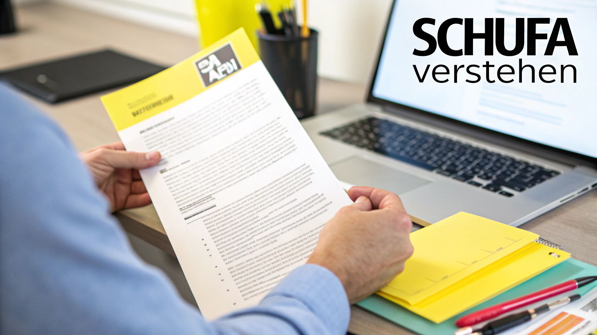
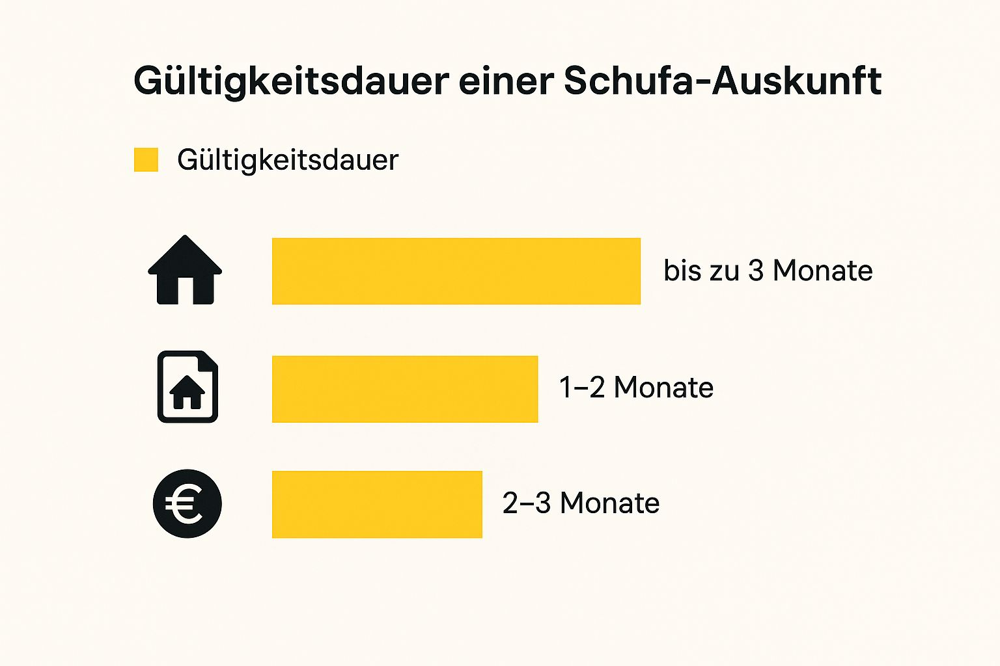

Du hast deine Traumwohnung gefunden und der Vermieter möchte eine Schufa-Auskunft sehen. Klar, dass da die Frage aufkommt: *Wie lange ist das Dokument eigentlich gültig?*

Ganz offiziell hat eine Schufa-Auskunft **kein Verfallsdatum**. Aber mal ehrlich: In der echten Welt, also bei der Wohnungssuche, sieht das komplett anders aus. Für Vermieter zählt nur, wie es *jetzt gerade* um deine Finanzen bestellt ist.

## Wie lange deine Schufa-Auskunft wirklich akzeptiert wird

Auch wenn das Dokument theoretisch ewig hält – für Vermieter ist es nur eine Momentaufnahme. Und die sollte möglichst aktuell sein. Dein Finanzleben steht ja nicht still. Ein neuer Handyvertrag hier, eine Ratenzahlung da – all das kann deinen Score beeinflussen.

Ein älteres Dokument zeigt diese Entwicklungen natürlich nicht und verliert deshalb für den Vermieter schnell an Wert.

## Die ungeschriebene Regel für die Wohnungssuche

In der Praxis hat sich eine Faustregel durchgesetzt: Die meisten Vermieter und Hausverwaltungen wollen eine Schufa-Auskunft sehen, die **nicht älter als 14 Tage, maximal aber vier Wochen** ist. Alles, was älter ist, wirkt schnell überholt und kann deine Chancen beim Wohnung mieten schmälern.

Stell es dir einfach so vor: Eine frische Auskunft ist wie eine frisch gestempelte Eintrittskarte. Sie signalisiert, dass du die Sache ernst nimmst, top vorbereitet bist und nichts zu verbergen hast. Das schafft sofort Vertrauen und hebt dich positiv von der Konkurrenz ab.

> Eine aktuelle Schufa-Auskunft ist mehr als nur ein Stück Papier. Sie ist dein wichtigstes Argument, um zu zeigen: „Hey, auf mich kannst du dich verlassen!“

Was heißt das für dich? Hol dir deine Auskunft am besten erst dann, wenn du wirklich aktiv auf die Suche gehst. So bist du immer auf der sicheren Seite und hast beim schneller Wohnung finden einen echten Vorteil in der Tasche.

## Gültigkeit der Schufa-Auskunft auf einen Blick

Diese Tabelle fasst für dich nochmal zusammen, was du über die Gültigkeit wissen musst und wie du am besten vorgehst.

| Aspekt | Erklärung | Unsere Empfehlung für dich |
| :-- | :-- | :-- |
| **Offizielle Gültigkeit** | Rein rechtlich gesehen hat eine Schufa-Auskunft kein Ablaufdatum. Die darin enthaltenen Daten sind zu einem bestimmten Stichtag korrekt. | Verlass dich nicht darauf. Für die Wohnungssuche ist dieser Punkt irrelevant. |
| **Praktische Akzeptanz** | Vermieter möchten ein aktuelles Bild deiner Bonität. Ältere Dokumente spiegeln eventuelle Veränderungen nicht wider. | Deine Auskunft sollte **maximal 4 Wochen alt** sein, am besten sogar jünger als 14 Tage. |
| **Der richtige Zeitpunkt** | Wenn du die Auskunft zu früh anforderst, ist sie möglicherweise schon veraltet, wenn du sie brauchst. | Bestelle die Auskunft erst, wenn du die ersten Besichtigungstermine planst. |

Kurz gesagt: Die offizielle Regelung kannst du getrost vergessen. Richte dich immer danach, was Vermieter in der Praxis erwarten, dann bist du auf dem besten Weg in deine neue Wohnung.

## Was hinter der "Gültigkeit" deiner Schufa-Auskunft wirklich steckt

Offiziell hat eine Schufa-Auskunft kein Verfallsdatum. Aber mal ehrlich, das ist nur die halbe Wahrheit. In der Praxis, also wenn du ein Haus kaufen oder eine Wohnung mieten willst, sieht die Welt ganz anders aus.

Stell dir dein Finanzleben nicht wie ein Foto vor, das du einmal machst und dann an die Wand hängst. Es ist eher wie ein Film, der ständig weiterläuft. Jeder neue Handyvertrag, jede Ratenzahlung, jede Kreditanfrage – all das sind neue Szenen in deiner ganz persönlichen Finanz-Story.

Ein Ausdruck, der schon ein paar Monate alt ist, kann diese neuen Entwicklungen natürlich nicht abbilden. Für einen Vermieter, der auf Nummer sicher gehen will, ist so ein altes Dokument praktisch wertlos. Er will ja wissen, wie du **heute** aufgestellt bist, nicht wie deine Finanzen vor einem halben Jahr aussahen.

### Wie lange die Schufa deine Daten überhaupt speichern darf

Hier kommt das Gesetz ins Spiel, genauer gesagt die Datenschutz-Grundverordnung (DSGVO). Sie legt fest, wie lange die Schufa deine Daten behalten darf. Denn nicht jede Info bleibt für immer und ewig in deiner Akte – ganz im Gegenteil, es gibt feste Löschfristen.

Diese Fristen sind eine Art Schutzschild. Sie sorgen dafür, dass dir alte Geschichten nicht ewig nachhängen und das Bild deiner Finanzen fair und aktuell bleibt.

> Wenn du die Speicherfristen kennst, hast du die Zügel in der Hand. Du weißt dann, warum bestimmte Einträge auftauchen und – noch wichtiger – wann sie wieder verschwinden müssen.

Die Schufa hält sich dabei an genaue Zeiträume, die je nach Art des Eintrags variieren. Eine einfache Kreditanfrage zum Beispiel wird nur **zwölf Monate** gespeichert. Für Dritte, wie deinen potenziellen Vermieter, ist sie sogar schon nach **zehn Tagen** unsichtbar.

Ein komplett abbezahlter Kredit bleibt hingegen noch **drei Jahre** nach der letzten Rate vermerkt. Das zeigt Vertragspartnern, dass du in der Vergangenheit zuverlässig warst. Mehr zu den Hintergründen liest du übrigens auch auf der [Wikipedia-Seite zur Schufa-Datenspeicherung](https://de.wikipedia.org/wiki/Schufa).

Dieses System soll ein möglichst genaues und faires Bild deiner Kreditwürdigkeit zeichnen. Für dich bedeutet das aber auch: Dein Schufa-Score ist immer in Bewegung. Und genau deshalb ist es beim **Haus kaufen** oder **Wohnung mieten** so wichtig, eine top-aktuelle Auskunft parat zu haben.

## Was Vermieter bei der Bonitätsprüfung wirklich sehen wollen

Mal ganz ehrlich: Was genau interessiert einen Vermieter, wenn er nach deiner Bonität fragt? Die ungeschriebene Regel ist eigentlich ganz einfach: **Je frischer deine Auskunft, desto besser**. Denk mal drüber nach: Wenn du einem Freund Geld leihst, willst du doch auch wissen, wie es *aktuell* bei ihm aussieht, nicht wie seine Lage vor drei Monaten war, oder?

Genauso ticken Vermieter. Für sie geht es um Sicherheit. Sie wollen das gute Gefühl haben, dass die Miete pünktlich und zuverlässig auf ihrem Konto landet. Eine ältere Auskunft wirft da immer die Frage auf: Was hat sich in der Zwischenzeit vielleicht alles verändert?

### Die magische Zeitspanne für deine Auskunft

Die meisten Vermieter sind da ziemlich klar: Eine Schufa-Auskunft sollte nicht älter als **14 Tage bis maximal vier Wochen** sein. Alles, was älter ist, verliert schnell an Aussagekraft und könnte dazu führen, dass deine Bewerbung im Stapel nach unten rutscht.

Mit einem top-aktuellen Dokument beweist du nicht nur, dass du dir die Miete leisten kannst. Du zeigst damit auch, dass du die Sache ernst nimmst und gut organisiert bist – und das sind genau die Eigenschaften, die sich jeder Vermieter von seinem Mieter wünscht. Eine frische Auskunft ist also dein stiller Händedruck, der sofort Vertrauen schafft.

> Eine top-aktuelle Bonitätsprüfung ist dein bester erster Eindruck. Sie zeigt dem Vermieter auf einen Blick, dass du ein vertrauenswürdiger und gut vorbereiteter Kandidat für die Wohnung bist.

Um bei der Besichtigung wirklich souverän aufzutreten, hilft es ungemein, wenn du genau verstehst, [was eine Bonitätsauskunft eigentlich ist](https://immobilien-bot.de/2025/08/31/was-ist-eine-bonitatsauskunft/) und welche Infos da drinstehen. Mit dem Wissen im Hinterkopf gehst du gleich viel selbstbewusster ins Gespräch.

Also, fassen wir zusammen:

- **Aktualität ist das A und O:** Eine Auskunft, die älter als einen Monat ist, wirkt schnell veraltet.
- **Vertrauen aufbauen:** Mit einem frischen Nachweis zeigst du dich als verlässlicher Vertragspartner.
- **Vorsprung sichern:** Du hebst dich von der Konkurrenz ab, die vielleicht mit alten oder unvollständigen Unterlagen ankommt.

Sei also clever und hol dir die Auskunft erst dann, wenn du wirklich kurz davorstehst, dich aktiv auf Wohnungen zu bewerben.

## So kommst du schnell an deine Schufa-Auskunft

Du steckst mitten in der Wohnungssuche und brauchst schnell eine aktuelle Schufa-Auskunft? Kein Problem. Du solltest allerdings wissen, dass es zwei grundlegend verschiedene Wege gibt, um an das begehrte Dokument zu kommen – und die unterscheiden sich gewaltig, was Tempo und Kosten angeht.

Da wäre zum einen dein gutes Recht auf die kostenlose Datenkopie nach Artikel 15 der DSGVO. Die kannst du einmal pro Jahr anfordern, um zu checken, was die Schufa alles über dich gespeichert hat. Der Haken? Sie ist eigentlich nur für deine eigenen Unterlagen gedacht, nicht zur Weitergabe an den Vermieter, und kommt aus Datenschutzgründen ganz klassisch per Post.

### Kostenlos oder kostenpflichtig – wo ist der Unterschied?

Bei der kostenlosen Variante musst du Geduld mitbringen. In der Regel dauert es **zwischen einer und vier Wochen**, bis der Brief bei dir im Kasten liegt. Das hängt ein bisschen von der Auslastung bei der Schufa und natürlich von der Post ab. Wenn du aber auf dem Wohnungsmarkt schnell zuschlagen musst, ist das oft eine Ewigkeit. Mehr zu den genauen Wartezeiten erfährst du [in diesem Überblick zu verschiedenen Auskunfteien](https://www.bonify.de/wie-lange-dauert-schufa-auskunft).

Und genau hier kommt die zweite Option ins Spiel: der kostenpflichtige **SCHUFA-BonitätsCheck**. Den bekommst du in der Regel sofort online als PDF zum Herunterladen. Dieses Dokument ist extra für Dritte wie Vermieter gemacht. Es bestätigt deine Zahlungsfähigkeit, ohne dabei sensible Details auszuplaudern.

> Beim Mieten oder Kaufen ist Geschwindigkeit oft der entscheidende Faktor. Ein sofort verfügbarer BonitätsCheck kann den Ausschlag geben, ob du deine Traumwohnung bekommst oder jemand anderes dir zuvorkommt.

Welche Gültigkeit in der Praxis für verschiedene Situationen erwartet wird, siehst du ganz gut in der folgenden Grafik.

Man erkennt sofort: Gerade bei Mietverträgen erwarten Vermieter eine top-aktuelle Auskunft, was den Zeitdruck bei der Wohnungssuche nochmals erhöht.

### Vergleich der Schufa-Auskunftsarten

Welche Schufa-Auskunft ist nun die richtige für dich? Hier siehst du die wichtigsten Unterschiede zwischen der kostenlosen Datenkopie und dem kostenpflichtigen BonitätsCheck auf einen Blick.

| Merkmal | Kostenlose Datenkopie (DSGVO) | SCHUFA-BonitätsCheck (kostenpflichtig) |
| :-- | :-- | :-- |
| **Kosten** | **Kostenlos** (einmal pro Jahr) | Einmalig **29,95 €** |
| **Zweck** | Eigene Kontrolle der gespeicherten Daten | Vorlage bei Dritten (z.B. Vermieter) |
| **Lieferzeit** | **1-4 Wochen** per Post | **Sofort** online als PDF |
| **Inhalt** | Umfassende Auflistung aller Daten | Kompaktes Zertifikat zur Bonität |
| **Weitergabe** | Nicht für Dritte bestimmt | Speziell für die Weitergabe konzipiert |

Am Ende ist die Strategie also ziemlich klar: Hol dir die kostenlose Datenkopie, um deine Einträge regelmäßig im Blick zu behalten und auf Fehler zu prüfen. Für die heiße Phase der Wohnungssuche solltest du aber auf den schnellen, kostenpflichtigen BonitätsCheck setzen. Damit bist du immer auf der sicheren Seite und sofort startklar.

## Deine Checkliste für die erfolgreiche Wohnungssuche

Okay, jetzt wo du die Theorie kennst, machen wir uns an die Praxis. Mit dem richtigen Vorgehen kannst du deine Wohnungssuche deutlich entspannter gestalten. Eine Top-Vorbereitung ist echt die halbe Miete – sie hebt dich von der Masse ab und verbessert deine Chancen ungemein.

Mein wichtigster Tipp direkt vorweg: Sei schneller als die anderen. Auch wenn du gerade noch gar nicht aktiv suchst, bestell dir schon mal deine kostenlose Datenkopie. Dann hast du sie parat, um deine Einträge zu prüfen, und siehst gleichzeitig, was die Schufa über dich gespeichert hat. Keine bösen Überraschungen!

### Deine Strategie für die Bewerbung

Sobald es ernst wird und du dich auf eine Wohnung bewirbst, brauchst du eine aktuelle Auskunft extra für den Vermieter. Hier geht es darum, einen super Eindruck zu machen und Vertrauen aufzubauen, aber ohne gleich dein ganzes Leben offenzulegen.

- **Die richtige Auskunft wählen:** Ganz wichtig – gib dem Vermieter niemals deine komplette Datenkopie mit allen Details! Hol dir stattdessen den **SCHUFA-BonitätsCheck**. Der sagt nur das aus, was der Vermieter wissen muss: „Ja, alles im grünen Bereich.“
- **Vollständigkeit siegt:** Eine lückenlose und ordentliche Bewerbungsmappe ist Gold wert. Eine frische Schufa-Auskunft darin zeigt sofort: Du bist zuverlässig und hast deine Sachen im Griff.
- **Perfektes Timing:** Bestell den BonitätsCheck am besten erst dann, wenn die ersten Besichtigungstermine anstehen. So ist er garantiert frisch genug und erfüllt die „jünger als **vier Wochen**“-Regel, die viele Vermieter im Kopf haben.

> Stell dir deine Bewerbungsmappe wie deine persönliche Visitenkarte vor. Eine aktuelle, saubere Schufa-Auskunft kann genau das Zünglein an der Waage sein, das dich deiner Traumwohnung einen riesigen Schritt näherbringt.

Mit diesen einfachen Kniffen bist du wirklich gut aufgestellt. Du beweist nicht nur, dass man sich auf dich finanziell verlassen kann, sondern auch, dass du die Suche ernst nimmst. Gerade wenn du nach [Privatwohnungen zum Mieten in Berlin](https://immobilien-bot.de/2025/09/02/privatwohnungen-mieten-berlin/) suchst, wo der Wettbewerb groß ist, kann dich das entscheidend nach vorne bringen.

## Häufig gestellte Fragen zur Schufa-Auskunft

Zum Schluss klären wir noch die typischen Fragen, die bei der Wohnungssuche rund um die Schufa-Auskunft immer wieder aufpoppen. Mit diesen Antworten bist du für jede Situation gewappnet und kannst Unsicherheiten direkt aus dem Weg räumen.

### Wie schnell bekomme ich die kostenlose Datenkopie?

Einmal im Jahr hast du laut Datenschutzgrundverordnung das Recht, eine kostenlose Selbstauskunft bei der SCHUFA anzufordern. Die kommt aus Sicherheitsgründen aber immer per Post – also nicht gerade ideal, wenn es schnell gehen muss.

In der Regel dauert der Versand **zwei bis fünf Werktage**, spätestens nach 30 Tagen muss sie aber bei dir im Briefkasten sein. Mehr spannende Details zu deinen Rechten findest du übrigens in [dieser anwaltlichen Erklärung zur SCHUFA-Datenkopie](http://www.gansel-rechtsanwaelte.de/datenschutz-recht/schufa-datenkopie-alles-was-sie-wissen-muessen). Für die schnelle Wohnungsbewerbung ist diese kostenlose Version also meist zu langsam.

### Muss ich meine komplette Schufa-Auskunft zeigen?

Ein ganz klares **Nein**! Deine kostenlose Datenkopie ist voll mit sensiblen Informationen, die deinen Vermieter absolut nichts angehen – zum Beispiel Infos zu Krediten oder Konten.

Für die Bewerbung ist wirklich nur der kostenpflichtige **SCHUFA-BonitätsCheck** gedacht. Der bestätigt lediglich, dass du kreditwürdig bist, ohne dabei private Details preiszugeben.

### Was, wenn ein Vermieter eine ältere Auskunft ablehnt?

Tja, das ist sein gutes Recht. Weil es keine gesetzliche Gültigkeitsdauer gibt, entscheidet der Vermieter ganz allein, wie alt das Dokument für ihn sein darf.

Lehnt er deine Auskunft ab, weil sie ihm zu alt vorkommt, bleibt dir leider nichts anderes übrig, als eine neue zu besorgen. Sieh es positiv: Eine topaktuelle Auskunft zeigt, dass du die Sache ernst nimmst und super vorbereitet bist. Das ist ein riesiger Pluspunkt, gerade bei der Wohnungsbesichtigung. Mehr dazu findest du übrigens in unserem [Artikel mit Tipps zur Wohnungsbesichtigung](https://immobilien-bot.de/2025/08/27/wohnungsbesichtigung-tipps/).

> **Profi-Tipp:** Sobald du eine Einladung zur Besichtigung bekommst, frag einfach direkt nach, wie alt die Auskunft maximal sein darf. So sparst du dir im Zweifel unnötige Kosten und zeigst gleichzeitig, dass du mitdenkst.

Mit diesem Wissen im Hinterkopf bist du für die nächste Bewerbungsrunde bestens gerüstet und kannst ganz souverän auftreten.

---

Bist du es leid, die besten Wohnungsangebote zu verpassen? Der **Immobilien Bot** durchsucht alle wichtigen Portale für dich und schickt dir sofort eine Benachrichtigung, wenn deine Traumwohnung online geht. Finde schneller, was du suchst, auf [https://www.immobilien-bot.de](https://www.immobilien-bot.de).
